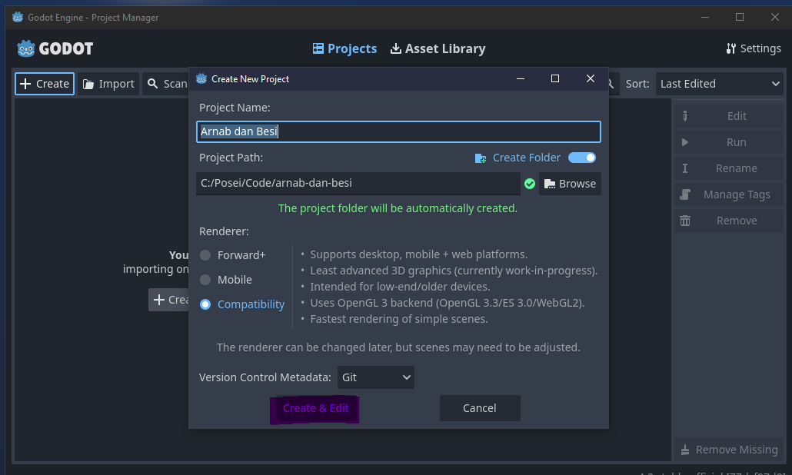

{}

# Getting Started with Godot 4

Welcome to our first lesson! Before diving into game development, let's get everything set up and understand some basic concepts. Don't worry if things seem overwhelming at first - we'll take it step by step.

## Downloading Godot

First things first, we need to get the Godot engine:

1. Visit the official Godot website (https://godotengine.org/)
2. Click on the Download button
3. Choose the latest Godot 4.x version for your operating system (Windows, Mac, or Linux)
4. Download the Standard version (not .NET unless you specifically want C#)
5. Once downloaded, extract the files to a location you can easily access

That's all you need! Godot is self-contained, so there's no installation process required.
> Note: there will be two godot executables, Godot_v4.3-stable_win64.exe and Godot_v4.3-stable_win64_console.exe, either of them is fine to use.

## Creating Your First Project

Let's create a new project:

1. Open the Godot executable you just downloaded
2. You'll see the Project Manager screen

3. Click on "Create New Project"

4. Choose a project name (I'm using "Arnab dan Besi", but you can use any name you like)

5. Select a location for your project

6. Leave the renderer settings at their defaults
7. Click "Create & Edit"

If you encounter any errors during this process, please reach out on discord.

## Understanding the Editor

When you first open the Godot editor, you'll see several panels. Don't worry - it's simpler than it looks tho ngl. Here are the key areas you need to know:

- **Left Panel**: This is where you'll find two important tabs:
  - Scene tab: Shows your scene hierarchy (we'll explain scenes/nodes soon)
  - FileSystem tab: Shows your project files and folders  

  

- **Right Panel**: This shows the properties of whatever node you have selected

- **Center Area**: This is your main workspace where you'll see and edit your scene

## Nodes and Scenes: The Building Blocks

In Godot, everything is built using **Nodes** and **Scenes**. Think of them like this:

- **Nodes** are like LEGO blocks - each one has a specific purpose (like displaying images, detecting collisions, or handling physics)
- **Scenes** are like LEGO models - they're collections of nodes arranged in a specific way

You can even use scenes as building blocks for other scenes, which makes organizing your game much easier!

## Creating Your First Character Scene

Let's create a scene for our character:

1. Click File > New Scene
2. For the root node, select "CharacterBody2D" (this is perfect for 2D games with physics)
3. Rename the root node to "HeavyBlade"
4. Add two child nodes:
   - Sprite2D (for the character's appearance)
   - CollisionShape2D (for physics and collision detection)

Save this scene as "heavy_blade.tscn"

### Understanding Our Node Structure

Let's break down what each node does:
- **CharacterBody2D**: Handles movement and physics for our character
- **Sprite2D**: Displays the character's image/animation
- **CollisionShape2D**: Defines the physical shape for collision detection

## Creating the Main Scene

Every Godot game needs a main scene - think of it as the starting point of your game:

1. Create another new scene
2. Use "Node2D" as the root node
3. Rename it to "Main"
4. Save it as "main.tscn"
5. Drag your "heavy_blade.tscn" from the FileSystem panel into the Scene panel to add it as a child of Main

### Setting the Main Scene

1. Go to Project > Project Settings
2. In the General tab, look for "Application > Run"
3. Set "Main Scene" to your main.tscn file

## Running Your Game

You can now test your game:
- Click the Play button in the top-right corner, or
- Press F5 on your keyboard

The first time you run it, Godot might ask you to select the main scene - choose main.tscn.

## What's Next?

Congratulations! You've just:
- Set up Godot
- Created your first project
- Learned about nodes and scenes
- Created a basic character scene
- Set up a main scene
- Learned how to run your game

In the next lesson, we'll add movement to our character and start making this look more like a real game!

Remember: Game development is a journey. Don't worry if some concepts aren't clear yet - they'll make more sense as we continue building our game.

Feel free to experiment with what you've learned, and don't hesitate to ask questions in the comments!

