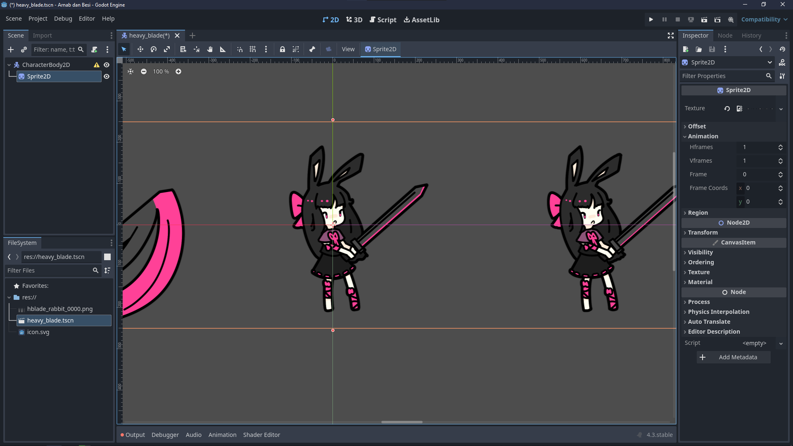

# Getting Started with Godot 4

Welcome to our first lesson! Before diving into game development, let's get everything set up and understand some basic concepts. Don't worry if things seem overwhelming at first - we'll take it step by step.

## Downloading Godot

First things first, we need to get the Godot engine:

1. Visit the official Godot website (https://godotengine.org/)
2. Click on the Download button
3. Choose the latest Godot 4.x version for your operating system (Windows, Mac, or Linux)
4. Download the Standard version (not .NET unless you specifically want C#)
5. Once downloaded, extract the files to a location you can easily access

That's all you need! Godot is self-contained, so there's no installation process required.
> Note: there will be two godot executables, Godot_v4.3-stable_win64.exe and Godot_v4.3-stable_win64_console.exe, either of them is fine to use.


## Creating Your First Project

Let's create a new project:

1. Open the Godot executable you just downloaded
2. You'll see the Project Manager screen

3. Click on "Create New Project"

4. Choose a project name (I'm using "Arnab dan Besi", but you can use any name you like)

5. Select a location for your project

6. Leave the renderer settings at their defaults
7. Click "Create & Edit"


If you encounter any errors during this process, please reach out on discord.

## Understanding the Editor

When you first open the Godot editor, you'll see several panels. Don't worry - it's simpler than it looks tho ngl. Here are the key areas you need to know:

- **Left Panel**: This is where you'll find two important tabs:
  - Scene tab: Shows your scene hierarchy (we'll explain scenes/nodes soon)
  - FileSystem tab: Shows your project files and folders  

  

- **Right Panel**: This shows the properties of whatever node you have selected


- **Center Area**: This is your main workspace where you'll see and edit your scene


## Nodes and Scenes: The Building Blocks

In Godot, everything is built using **Nodes** and **Scenes**. Let's explore this concept with a practical example.

### Example: Character Scene
Take a look at this gameplay video:
<video src="gameplay_example.mp4" controls></video>

Looking at this character in action, you might wonder:
- How is the scene structured?
- What nodes are used to create this behavior?

Don't worry if you can't answer these questions yet. You'll understand them naturally as you learn about nodes and scenes.

### Scene Structure
Here's how the character's scene is organized:


The scene uses a "CharacterBody2D" as its root node, which handles movement and physics. It contains several child nodes:

| Node Type | Purpose |
|-----------|---------|
| Sprite2D | Displays the character's appearance |
| CollisionShape2D | Defines the physical shape for collision detection |
| AnimationPlayer | Controls character animations |
| Area2D | Handles the character's attack area |
| AudioStreamPlayer2D | Manages sound effects |
   > Note: In the screenshot you can see the CharacterBody2D is named HeavyBlade and Area2D is named BasicAttackHitbox. This is because we can rename the node to better describe what their purpose is because one scene can have multiples nodes of the same type.

This structure demonstrates a key principle in Godot: each node serves a specific purpose, and together they create complex behaviors. Think of it like building with LEGO blocks - each piece has its role, and combining them creates something greater.

Let's put this knowledge into practice by recreating this character scene step by step.

## Creating Your First Character Scene

Let's create a scene for our character. Follow these steps:

### 1. Create a New Scene
1. In the Scene tab, you'll notice you're working with an empty scene
2. To create a new scene, we need a root node
3. Click "Other Node" and search for "CharacterBody2D"
   > Note: We'll explain why we're using CharacterBody2D in later lessons. For now, just know that it's perfect for creating controllable characters!
4. Click "Create" to add it as your root node


Now we have a new scene with CharacterBody2D as the root node, but we need to save it first.

### 2. Save Your Scene
1. Go to Scene → Save Scene (or press Ctrl+S)
2. Name your scene (e.g., "heavy_blade.tscn")
   > Note: .tscn is Godot's scene file extension. All your scenes will use this extension.


With our root node in place and scene saved, we can start adding the components that will make up our character.

### 3. Add a Sprite
1. Select your CharacterBody2D node
2. Click the '+' icon or press Ctrl+A to add a child node

3. Search for and select "Sprite2D"
   > Note: A sprite is a 2D image that represents game objects.


Now we have a Sprite2D node as a child of CharacterBody2D, but you won't see anything yet - we need to give it an image to display.

### 4. Configure the Sprite
1. Select the Sprite2D node
2. In the Inspector, locate the Texture property

3. Add your character's sprite sheet:
   - Either drag the image file directly into the Texture field
   - Or click the field and select the image file
    > Note: Here's the sprite sheet we'll be using:
    

    
4. Configure the sprite sheet:
   - Under Animation, set "Hframes" to 23 (horizontal frames)
   - Set "Vframes" to 1 (vertical frames)
   > This splits the sprite sheet into individual frames. Our character's sprite sheet contains 23 different poses arranged horizontally, and Godot needs to know how to divide them up.

    
5. Adjust scale to 0.5
   - Under Transform, set "Scale" to 0.5
   > This is because the sprite sheet is too big to fit in the default size.

    
### 5. Test Your Scene
1. Position your character in the center of the screen by dragging the root node
2. Press F6 or click the "Play Scene" button (film icon) to test
    
3. You should see your character displayed in the game window
    
   > Note: If you can't see your character, make sure it's positioned within the game window's visible area, make sure you're moving the root node not the sprite node.


## Manipulating The Scenes and Nodes

Now you have a basic scene, but it's just sitting there—static and lifeless. While you can manually adjust properties like position in the editor, how do we make things actually happen during gameplay?

The answer lies in scripts! Scripts tell nodes what to do while the game is running. For example, character movement is simply changing the position property over time based on player input.

With scripts, you can:
- Modify node properties in real time during gameplay
- React to player actions (keyboard/mouse input)
- Program game rules and behaviors

Moving forward, I assume you have a basic understanding of programming concepts (variables, functions, flow control, etc.), so I won't explain the fundamentals of GDScript (Godot's scripting language). If you’re completely new to programming, I recommend learning the basics first.  
> If you don't have ANY programming knowledge, I recommend you learn the basics of programming first.  
I'm available to help you get started—just ask in the Discord server if you need assistance.

---

### How Scripts Work in Godot

In Godot, you can attach a script to every node in a scene. Typically, however, you'll attach the script to the root node unless you have a specific reason to attach it to a child node.

To attach a script to a node:
- **Right-click the node** and select **"Attach Script"**, or
- **Select the node** and click the **+ icon** in the upper right corner.


You'll be prompted to choose the scripting language and name the script. Throughout this project, we'll be using GDScript.


For example, name your script "heavy_blade.gd" to match the scene name. You'll then see a script tab (replacing the scene tab) containing only:


```gdscript
extends CharacterBody2D
```
This indicates that the script is attached to a `CharacterBody2D` node.

---

### Writing Code in Your Script

Can you just write code directly in the script tab? Yes, but if you write code immediately below the `extends` line without wrapping it inside a function, you'll get an "unexpected identifier" error. This happens because all executable code must be placed inside a function. GDScript doesn't use a main() function; instead, it relies on virtual functions.


#### The `_ready()` Function

The `_ready()` function is called when the node is added to the scene. To test it, try adding a print statement:
```gdscript
func _ready():
    print("Hello, World!")
```
Run the scene, and you'll see "Hello, World!" printed in the console—proving that `_ready()` is called when the node enters the scene.


#### The `_process()` Function

The `_process()` function is called every frame. This is ideal for tasks like moving a character:
```gdscript
func _process(delta: float) -> void:
  print("Hello, World!")
```
Running the scene will print "Hello, World!" every frame, confirming that `_process()` runs continuously.


#### The `_unhandled_input()` Function

The `_unhandled_input()` function is triggered whenever the player provides any input. For example, to detect key presses:
```gdscript
func _unhandled_input(event: InputEvent) -> void:
    print("Something is pressed")
```
When you run the scene, "Something is pressed" will appear in the console every time an input is detected.


---

### Moving the Character

Now that you know where to write your code, let's start moving the character.

#### Understanding Movement

Every node in Godot has a `position` property, which is a `Vector2`—essentially a pair of (x, y) coordinates. Here's how you modify the position:
- **Right:** Add to the `x` coordinate.
- **Left:** Subtract from the `x` coordinate.
- **Up:** Subtract from the `y` coordinate (note: the y-axis is inverted in Godot).
- **Down:** Add to the `y` coordinate.


#### Moving with `_process()`

First, try moving the character automatically by modifying its position in the `_process()` function:
```gdscript
func _process(delta: float) -> void:
    position += Vector2(5, 0)
```
Running the scene will move the character to the right because you’re adding 5 to its x position every frame.
<video src="move_right.mp4" controls></video>

To move it down, modify the y position:
```gdscript
func _process(delta: float) -> void:
    position += Vector2(0, 5)
```
This will cause the character to move downward.

I suggest experimenting with the movement to get a better understanding of how it works.

#### Moving with Arrow Keys

To move the character using the arrow keys, first define the keys in your project settings under **Input Map**:
1. Add a new action called `move_right` and assign the right arrow key.
2. Repeat for `move_left`, `move_up`, and `move_down` with the corresponding arrow keys.


Then, implement the input handling:
```gdscript
func _unhandled_input(event: InputEvent) -> void:
    if event.is_action_pressed("move_right"):
        position += Vector2(5, 0)
```
Running the scene now will move the character to the right when you press the right arrow key.

Complete the code to handle all directions:
```gdscript
func _unhandled_input(event: InputEvent) -> void:
    if event.is_action_pressed("move_right"):
        position += Vector2(5, 0)
    if event.is_action_pressed("move_left"):
        position += Vector2(-5, 0)
    if event.is_action_pressed("move_up"):
        position += Vector2(0, -5)
    if event.is_action_pressed("move_down"):
        position += Vector2(0, 5)
```
Now, when you run the scene, the character will move in the corresponding direction when you press the arrow keys.
<video src="move_jitter.mp4" controls></video>

However, you'll notice that the character moves in a jerky manner. This is because the movement is applied when input is detected, meanwhile movement is often continuous.

And it turns out that the `_unhandled_input()` function is not so well suited for this kind continuous input.

let's refactor it into the process function.

```gdscript
func _process(delta: float) -> void:
    if Input.is_action_pressed("move_right"):
        position += Vector2(5, 0)
    if Input.is_action_pressed("move_left"):
        position += Vector2(-5, 0)
    if Input.is_action_pressed("move_up"):
        position += Vector2(0, -5)
    if Input.is_action_pressed("move_down"):
        position += Vector2(0, 5)
```
<video src="move_smooth.mp4" controls></video>


## Conclusion

Congratulations on completing your first lesson! Today, you learned how to download and set up Godot, create your first project, navigate the editor, and build a basic scene using nodes and scripts. You've taken an essential first step on your game development journey.

Remember, this early stage includes a bit of heavy handholding to ensure you feel comfortable with the new concepts. As you grow more confident, the guidance will gradually become less detailed, giving you more space to experiment and explore on your own. This lesson was intentionally kept short to prevent overwhelming your brain with too much information at once.

Please do take the time to practice what you've learned. Try to create your own scenes and scripts and experiment with the code. 
Even better if you could notice the questionable parts of the code I left deliberately.
What is delta? 
What is the `-> void`?
Is this really the best way to move the character?
How can we make it move more smoothly?

If you encounter any issues, feel free to ask in the Discord server.

Great job on taking your first step—keep up the momentum, and happy coding!

I'll see you in the next lesson!