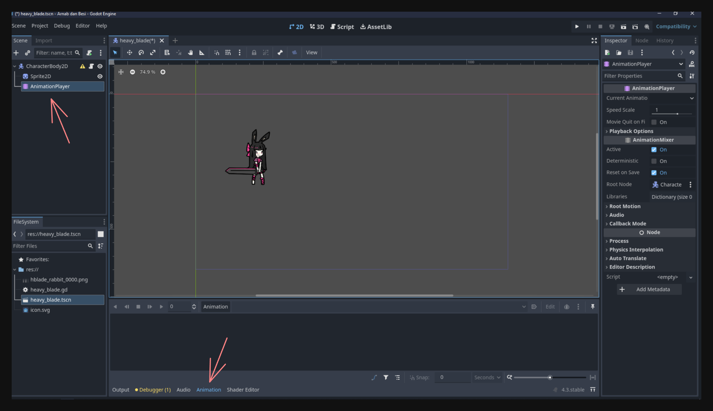
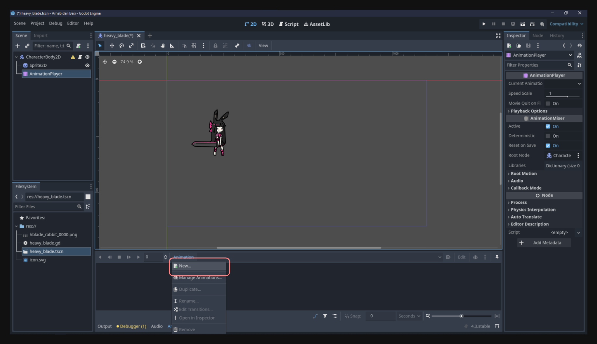
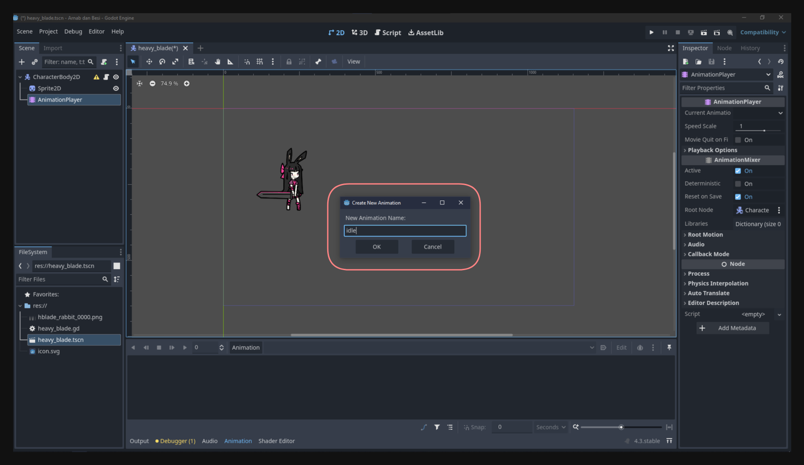
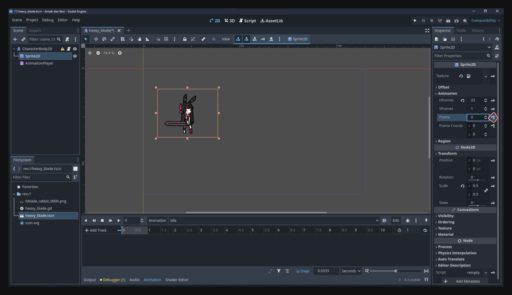
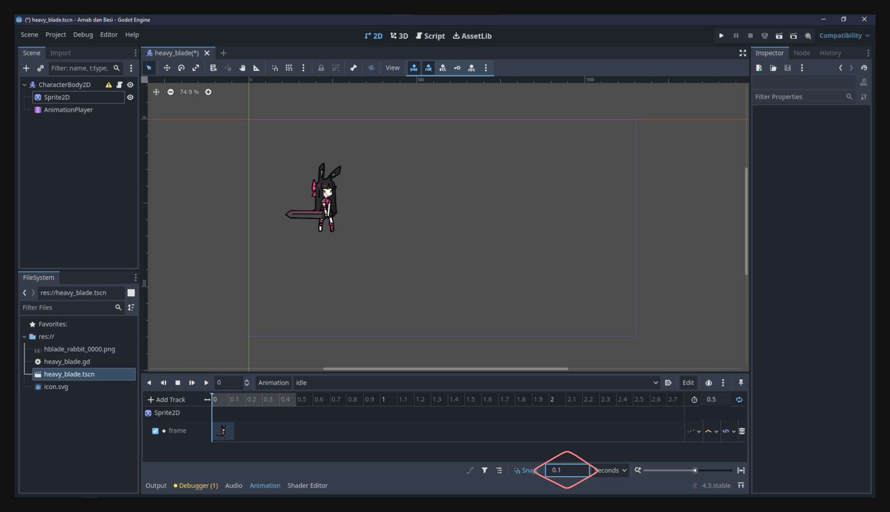
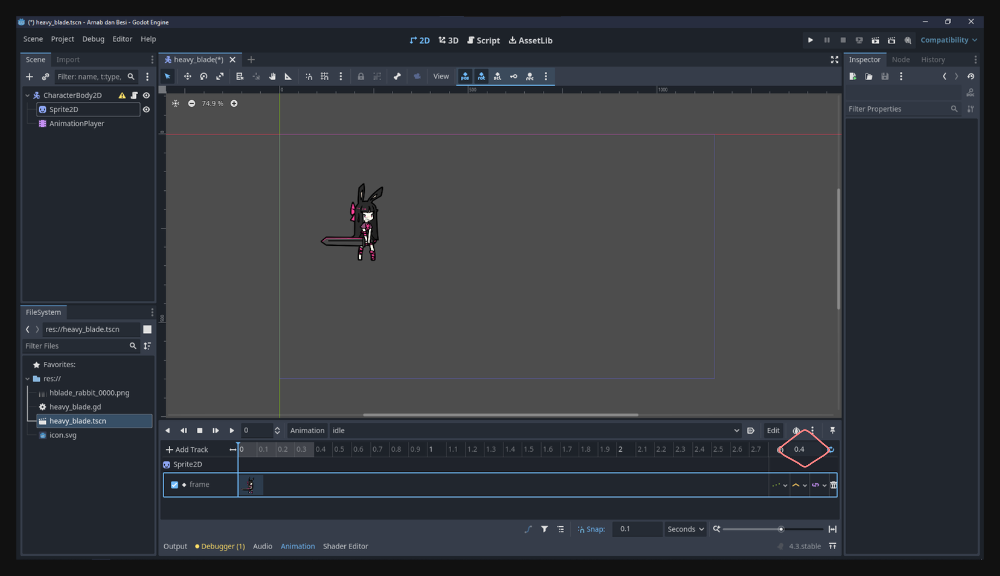
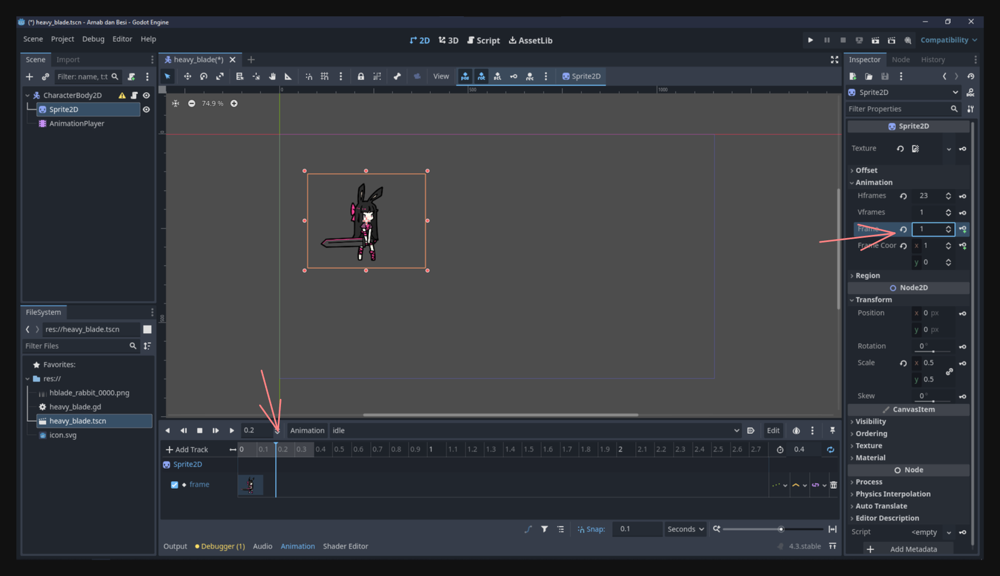

## Introduction
Animation is a key aspect of making games—after all, making a game is, in part, about making images move in response to user inputs or internal game logic. In this lesson, we will explore how to create and control animations in Godot 4 using the **AnimationPlayer** node and scripting. By the end, you will have a solid grasp of how to animate a character’s idle and movement states, and how to control these animations dynamically via code.

---

## Animation Player

The **AnimationPlayer** node in Godot allows you to create, edit, and control animations for any node property over time (e.g., position, rotation, scale, sprite frame index, etc.). In this lesson, we’ll start by adding simple **idle** and **movement** animations to a character, and then we’ll learn how to trigger them with code.

### Controlling Node Properties with Animation Player

Let’s begin by controlling the animation strictly through **AnimationPlayer**—no code yet. This will help you understand how keyframes and animation tracks work in Godot.

#### 1. Adding Animation Player to the Character Scene
1. In your Scene panel (usually on the left in the Godot editor), search for **AnimationPlayer** and add it as a child of your character scene.  
2. Select the **AnimationPlayer** node; you should notice a new tab labeled **Animation** at the bottom panel of the editor. This is the animation panel where you’ll manage and preview all your animations.


#### 2. Creating a New Animation
1. In the animation panel, click **New Animation**.  

2. Name this animation **idle**, since it will represent your character’s idle state.


Godot will now create an empty timeline for your new animation, and you can begin adding tracks/keyframes to define how properties change over time.

#### 3. Inserting a Node’s Property into the Animation Track
1. Make sure the **AnimationPlayer** is still selected and the **idle** animation is open in the animation panel.  
2. Select the node you want to animate—in this case, possibly a **Sprite2D** that shows your character’s frames.  
3. In the Inspector, find the property you want to animate (We'll use the frame property). 
4. Check from what frame to what frame the animation is.

<video src="checking_frame.mp4" controls></video>

5. Click the **key** icon beside that property to insert a key at the current timeline position. Then click create when prompted.


6. Since we'll be working with pixel art, adjust the snapping to a small value so it's easier to control the animation, I'm using 0.1.


7. Also adjust the animation length of the animation, I'm using 0.4 seconds.


8. Drag the timeline and add another keyframe, I'll add the second keyframe at 0.2 seconds.


You can experiment with the timeline position to control the speed of switching between frames. The closer the keyframes are, the faster the animation will be.

#### 4. Playing the Animation
To see your animation in action:
1. Click the **Play** button in the animation panel.  
2. Observe the sprite changing frames according to the keyframes you set.  
3. Adjust keyframes (timing, frame numbers, etc.) to get the desired effect, and preview again.

#### 5. Making It Loop
Since this idle animation should repeat indefinitely:
1. In the animation panel, click the **Loop** button (often represented by a circular arrow).  
2. Make sure “Loop” is checked in the animation’s properties so it never stops playing.

#### 6. Setting a Default Animation
To make the **idle** animation play automatically when the scene is loaded:
1. Click the **Default** button in the animation panel.  
2. This tells Godot to play **idle** by default when the scene starts.
<video src="set_loop.mp4" controls></video>

Play the scene and see the idle animation playing.

---

### Creating Movement Animations
Next, we’ll create two new animations: **move_left** and **move_right**. These will be triggered when the player moves the character left or right, respectively.

#### 1. Creating the Animations
Repeat the same process:
1. In the animation panel, create a new animation and name it **move_left**.  
2. Create another new animation and name it **move_right**.

At this point, you have three animations in your **AnimationPlayer**: **idle**, **move_left**, and **move_right**.

I trust you can do the rest of the steps by yourself.

---

## Controlling Animation with Code
While controlling animations manually in the AnimationPlayer is good for fixed or non-interactive scenarios, you’ll often want to decide which animation to play based on game logic (e.g., player input, velocity, or AI states). This is where GDScript comes in.

### Determining Movement Direction
We want to play the **move_left** animation when the character is moving left, and the **move_right** animation when the character is moving right. If the character is not moving at all, we play **idle**.

how do we detect this in code? There are two common ways to determine movement direction: checking player input or checking the character's velocity
1. **Check Input Actions**: If `Input.is_action_pressed("move_left")` is true, then play “move_left.” Same for “move_right.”  
2. **Check Velocity**: Use the character’s velocity (e.g., `velocity.x`) to determine whether it’s moving left or right.

A more robust method is to rely on velocity, since it accounts for all possible influences (player input, physics, etc.) and only plays movement animations when the character is actually moving.

---

### Updating Movement Code Logic
In Godot 4, the **CharacterBody2D** node provides built-in movement methods (e.g., `move_and_slide()`) and a `velocity` property. Typically, you might calculate velocity from user input and apply it to the character with each frame.

Updated character script:
```gdscript
extends CharacterBody2D

func _process(delta: float) -> void:
    var direction = Vector2.ZERO
    
    if Input.is_action_pressed("move_left"):
        direction.x = -5
    if Input.is_action_pressed("move_right"):
        direction.x = 5
    if Input.is_action_pressed("move_up"):
        direction.y = -5
    if Input.is_action_pressed("move_down"):
        direction.y = 5
        
    velocity = direction
    
    move_and_slide()
```

- `direction` represents the desired direction based on the player’s input.  
- `move_and_slide()` actually moves the character based on the velocity.

Now we have a velocity. We can detect whether `velocity.x` is negative (moving left), positive (moving right), or zero (not moving horizontally).

If the character is moving too slow, you can increase the value 5 to a higher number.
I'll use 200.

---

### Getting a Reference to the Animation Player in Code
To switch animations via code, you need to reference the **AnimationPlayer** node. For example, if your scene’s structure is:

```
CharacterBody2D
|- Sprite2D
|- AnimationPlayer
```

You can get the AnimationPlayer with:

```gdscript
var animation_player = get_node("AnimationPlayer")
```

---

### Controlling Animation with Logic
Finally, we combine the movement logic (velocity) with animation control.

**Full Script**:

```gdscript
extends CharacterBody2D

var animation_player

func _ready():
    # Assign the AnimationPlayer node to the animation_player variable when the scene is ready
    animation_player = get_node("AnimationPlayer")

func _process(delta: float) -> void:
    var direction = Vector2.ZERO
    
    if Input.is_action_pressed("move_left"):
        direction.x = -200
    if Input.is_action_pressed("move_right"):
        direction.x = 200
    if Input.is_action_pressed("move_up"):
        direction.y = -200
    if Input.is_action_pressed("move_down"):
        direction.y = 200
        
    velocity = direction
    
    move_and_slide()
    
    if velocity.x > 0:
        animation_player.play("move_right")
    elif velocity.x < 0:
        animation_player.play("move_left")
    elif velocity.y != 0:
        animation_player.play("move_right") 
    else:
        animation_player.play("idle")

```

1. When `velocity.x` is greater than 0, the character is moving right, so we call `play("move_right")`.  
2. When `velocity.x` is less than 0, the character is moving left, so we call `play("move_left")`.  
3. When `velocity.y` is not 0, the character is moving up or down, so we also call `play("move_right")`.
3. If `velocity.x` is 0, we revert to the idle animation.

This code ensures the correct animation is always playing based on your character’s horizontal movement.

Play the scene and see the character moving.

<video src="movement.mp4" controls></video>

---

## Conclusion
By understanding both the **AnimationPlayer** node’s timeline/keyframe approach and how to trigger animations through GDScript, you unlock a powerful way to make your characters (and other objects) come to life. You can now:

- Create and edit animations visually in the Godot editor.  
- Loop or set default animations for basic states like idling or walking.  
- Write scripts that switch animations dynamically based on movement, input, velocity, or any other in-game variables.

This foundation will carry you through more advanced animation features such as blending, animation trees, and state machines. But for now, you have the essentials of how to control animations in Godot 4. 

If you encounter any issues, feel free to ask in the Discord server.

I'll see you in the next lesson!