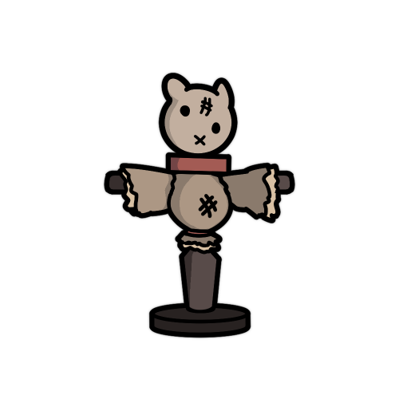
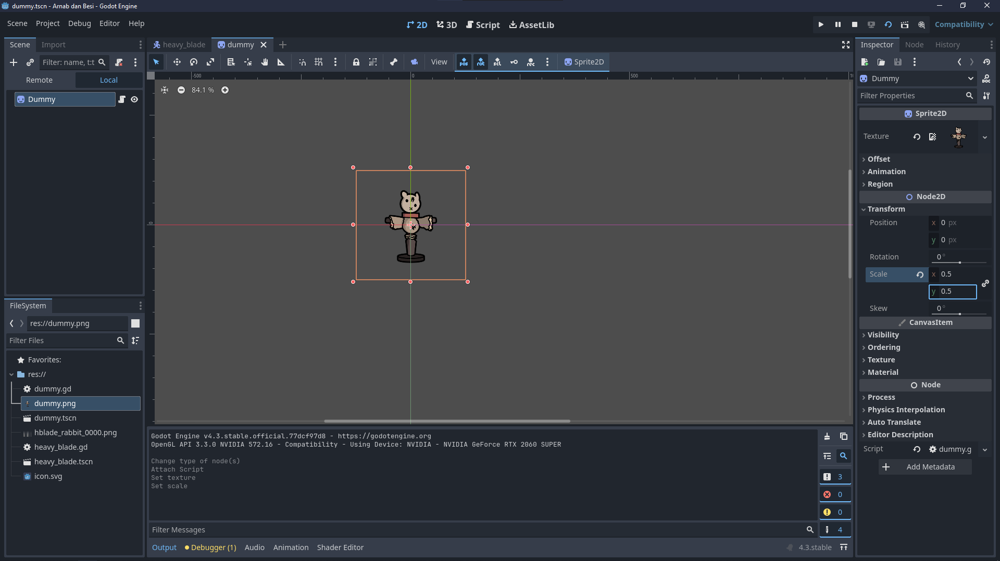
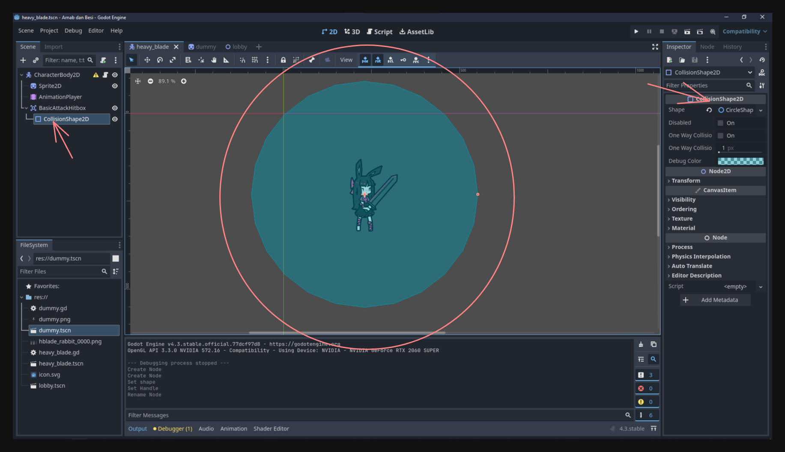
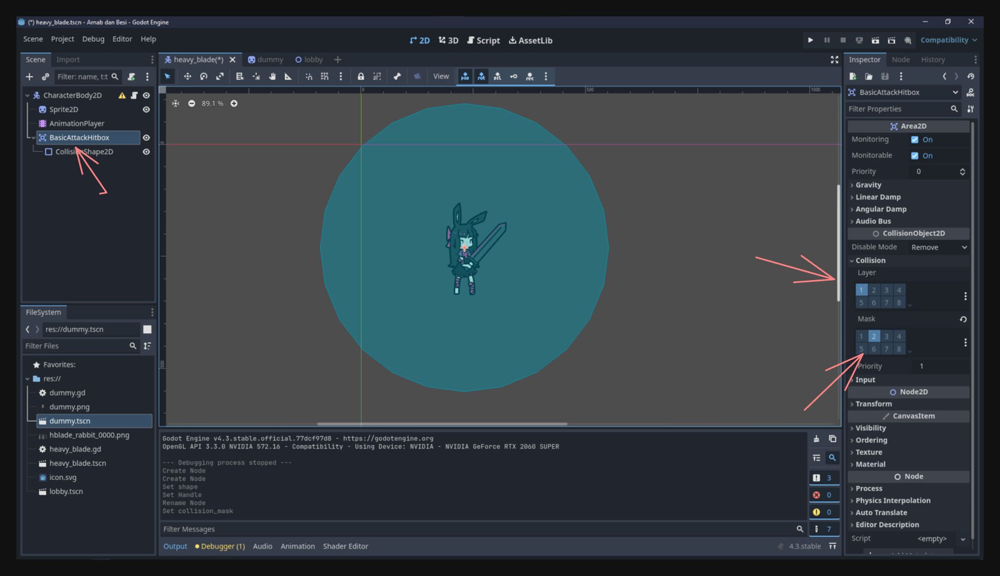
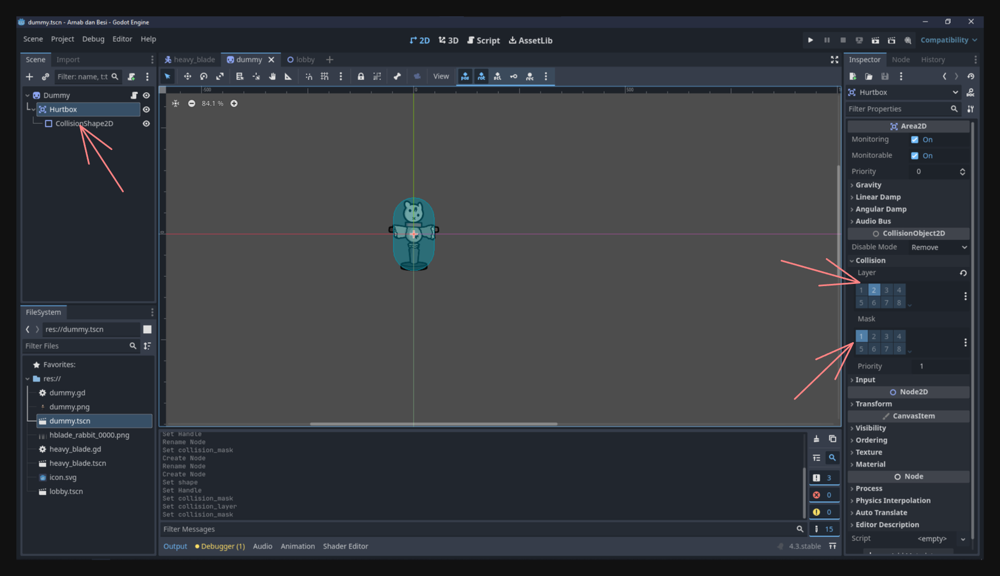
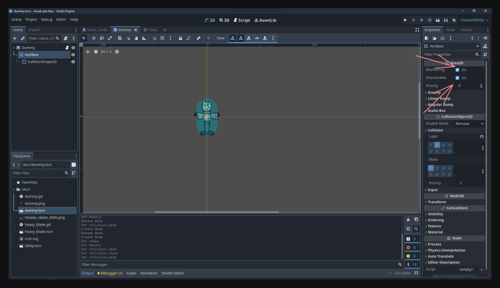
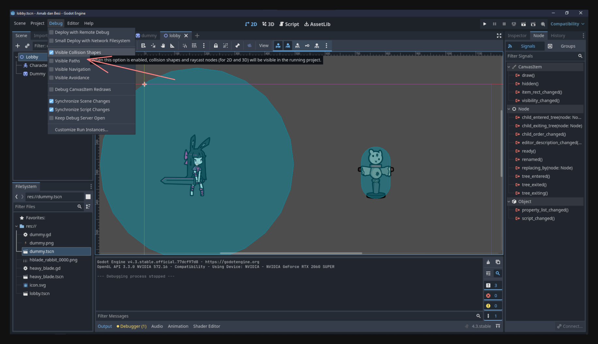
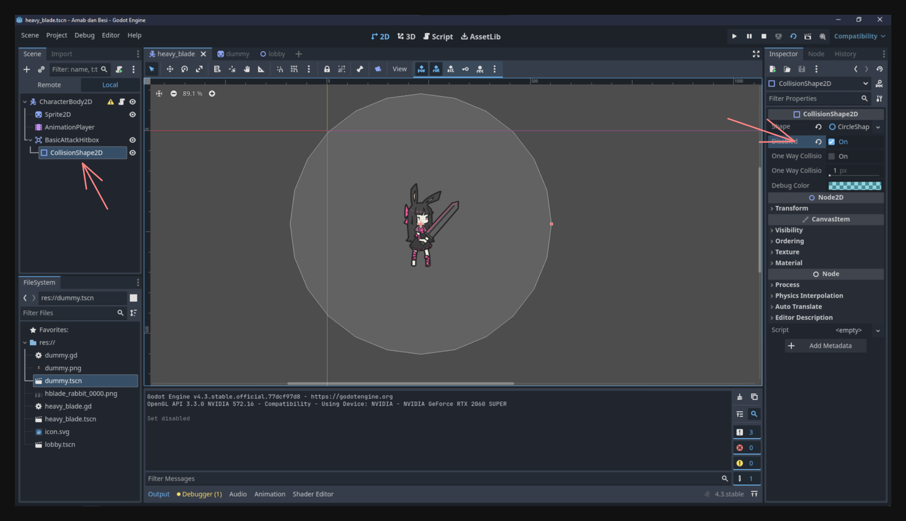

## Introduction

In this lesson, we’ll add a basic attack animation to our player and detect collisions between the player’s attack and an enemy. This process involves setting up an **attack input**, creating **hitboxes** (on the player) and **hurtboxes** (on the enemy), and controlling when those hitboxes are active so the enemy only gets damaged during the actual attack frames.

---

## Adding an Attack Animation

First, we need an animation that shows our character in the act of attacking.

1. **Create the Animation**  
   Open your `heavy_blade.tscn` (player scene), select the **AnimationPlayer**, and create a new animation called `basic_attack`. Add the frames (or keyframes) that visually represent your character’s swinging motion. This ensures we have a dedicated sequence for the attack, separate from idle and run.

2. **Adjust Timing and Frames**  
   Once you’ve added the frames, adjust the length so the motion feels responsive. Too long might make your character feel sluggish, and too short may be barely noticeable. You can test different speeds until it looks right.  

At this point, you’ll have an animation that looks good in the editor but isn’t triggered by any in-game input yet.

Here's my basic attack animation (You can copy it if you want):
<video src="attack_animation.mp4" controls></video>

---

## Adding Attack Input

Next, let’s make it so pressing a key triggers the new `basic_attack` animation.

1. **Create a New Input Action**  
   Go to **Project > Project Settings > Input Map**, add a new action named `basic_attack`, and assign it to the `Z` key. This separates your attack logic from a specific key, allowing you to rebind it easily later if needed.

2. **Detect Input in Your Script**  
   In your `heavy_blade.gd`, add or modify `_unhandled_input(event)` to look for the `basic_attack` action. When it’s pressed, play the `basic_attack` animation:

   ```gdscript
   func _unhandled_input(event):
       if event.is_action_pressed("basic_attack"):
           animation_player.play("basic_attack")
   ```

3. **Avoid Overwriting the Attack Animation**  
   Since you might already have code that changes the player’s Sprite2D frames during movement, make sure you don’t overwrite the `basic_attack` animation when the player tries to move. A simple check in your `_process(delta)` or movement function can skip updating animations if `basic_attack` is playing:

   ```gdscript
   ...

   if animation_player.current_animation != "basic_attack":
     if velocity.x > 0:
         animation_player.play("move_right")
     elif velocity.x < 0:
         animation_player.play("move_left")
     elif velocity.y != 0:
         animation_player.play("move_right") 
     else:
         animation_player.play("idle")

   ...
   ```

Now, pressing `Z` will trigger the attack animation. However, it still doesn’t affect anything else in the game.
<video src="nothing.mp4" controls></video>

---

## Creating a Dummy Enemy

Let's introduce an enemy to see if our player's attack can have an effect.

1. **New Scene for the Enemy**  
   Create a new scene called `dummy.tscn`, and use a **Sprite2D** as the root node. Assign it any enemy or placeholder texture you have. Or you use the one I provided:
   

2. **Basic Setup**  
   This enemy won’t move or fight back right now—it’s just there for you to test hitting it. Add a simple script (`dummy.gd`) to prepare for health or other logic later. Adjust the scale if it's too big or too small.
   

---

## Making a Lobby Scene

We need both the player and the dummy enemy in one scene so they can interact.

1. **Create `lobby.tscn`**  
   Add a **Node2D** as the root. This will serve as your “level” or “room” where you place objects.

2. **Instance Player and Enemy**  
   Drag `heavy_blade.tscn` (player) and `dummy.tscn` (enemy) into `lobby.tscn`. Position them however you like.
   <video src="instance.mp4" controls></video>

3. **Test It Out**  
   Run `lobby.tscn`, move your player, and press `Z` to attack. You’ll see the animation, but the enemy won’t react, because we haven’t set up any collision or damage system yet.
   <video src="nothing.mp4" controls></video>

---

## Making the Enemy Take Damage

When we talk about attacking, there are generally two sides:

- **Hitbox**: The area on the attacking character that will deal damage.  
- **Hurtbox**: The area on the defending character that can receive damage.

---

## Adding a Hitbox

### Player Hitbox

1. **Add an Area2D**  
   In `heavy_blade.tscn`, add a child node to your player root node. Call it `BasicAttackHitbox` and set it to **Area2D**. This node will detect overlaps with enemy areas.

2. **Add a CollisionShape2D**  
   As a child of `BasicAttackHitbox`, add a **CollisionShape2D**. Size and shape it so it roughly matches where your attack will hit.
   

3. **Assign Collision Layers**  
   In the Inspector for `BasicAttackHitbox`, set the **Collision Layer** (what it “is”) to `1` and the **Collision Mask** (what it “sees”) to `2`. This means it belongs to layer 1 and will detect objects on layer 2.
   

### Enemy Hurtbox

1. **Add an Area2D**  
   In `dummy.tscn`, add a child node called `Hurtbox` (also **Area2D**). This defines where the enemy can be hit.

2. **Add a CollisionShape2D**  
   Under `Hurtbox`, add a **CollisionShape2D** that covers the enemy’s sprite.

3. **Assign Collision Layers**  
   In the Inspector, set **Collision Layer** to `2` and **Collision Mask** to `1`. This means the enemy’s hurtbox lives on layer 2 and detects objects on layer 1—perfect for matching your player’s hitbox.
   

By setting layers and masks this way, the player’s hitbox only interacts with the enemy’s hurtbox, preventing unwanted collisions with other layers.

---

## Connecting Signals and Dealing Damage

Now that the hitbox and hurtbox exist, we can tell the enemy to react when those two areas overlap.

1. **Enable Monitoring**  
   In both `BasicAttackHitbox` and `Hurtbox`, check **Monitoring** and **Monitorable** so they’ll detect overlaps.
   

2. **Connect `area_entered` on the Enemy**  
   Select `Hurtbox` in `dummy.tscn`, go to the Node tab > **Signals**, and connect `area_entered` to your `dummy.gd` script. You’ll get a function like:
   <video src="connect_signal.mp4" controls></video>

   ```gdscript
   func _on_hurtbox_area_entered(area: Area2D):
       if area.name == "BasicAttackHitbox":
           queue_free()
   ```

   For testing, we’re simply calling `queue_free()` to remove the enemy immediately. However, this will trigger even if your hitbox is active while idle (not actually swinging). We’ll fix that next.
   <video src="enemy_die.mp4" controls></video>

   >For debugging you can show the collision by activating it in the debug menu.
   

---

## Activating the Hitbox Only During Attack

1. **Disable Hitbox by Default**  
   In `BasicAttackHitbox`’s CollisionShape2D Inspector, check **Disabled**. That way, your hitbox is off until you decide to enable it.
   

2. **Toggle via Animation**  
   In `heavy_blade.tscn`, open the `AnimationPlayer`. For the `basic_attack` animation, add a **Property Track** for your `BasicAttackHitbox` CollisionShape2D node’s `disabled` property. At the frame where the weapon should connect, key it to `true`, and near the end of the swing, key it back to `false`.  
   <video src="animation_disable.mp4" controls></video>

   Now, the enemy will only take damage during the exact frames your attack is active.
   <video src="attack_die.mp4" controls></video>

---

## Adding Health Logic to the Enemy

If you don’t want your enemy to vanish in one hit, you can track its health:

```gdscript
var hp = 3

func _on_hurtbox_area_entered(area: Area2D):
    if area.name == "BasicAttackHitbox":
        hp -= 1
        if hp <= 0:
            queue_free()
```

This way, the enemy can require multiple hits to defeat.
<video src="attack_combo.mp4" controls></video>

---

## Conclusion

By following these steps, you've successfully:

- Created a dedicated **attack animation** and tied it to an **input action**.  
- Prevented your movement animations from overriding the attack.  
- Added **Area2D** nodes to form a basic **hitbox/hurtbox** system.  
- Used **collision layers and masks** to ensure only the player's attacks collide with the enemy's hurtbox.  
- Activated the hitbox **only during attack frames** through the animation timeline.  
- Allowed the enemy to have **health** (or no health) and get destroyed when it drops to zero.

With this foundation, you can expand your combat system by adding different attack types, varying damage, enemy knockback, or more sophisticated AI. Now your game has a functional combat loop—press `Z` to attack, and watch your dummy enemy react (or die) accordingly. Enjoy experimenting with these new tools in Godot!

I'll see you in the next lesson!