## Introduction
Up to this point, we've pieced together the foundational components of our game: a character, a dummy enemy, and a basic level. Although each piece is functional, the overall experience still feels closer to a tech demo than an actual game. Games thrive on immersion, atmosphere, and cohesive presentation, so let’s build out our environment and transform our bare scene into a living "lobby" area. This will not only make the project more exciting to work on but also give us a clearer vision of what our final game might look like.

---

## Window Settings and Game View
When you first run your Godot project, you might notice that resizing the game window doesn’t behave as you’d expect; the game simply grows or shrinks arbitrarily. To create a smoother, more consistent visual experience, we need to tell Godot how to handle window resizing and how to scale the game properly.

Right now, if you try to resize the game window, you’ll see it just changes the window size without affecting the actual game size:

<video src="window_reize.mp4" controls></video>

### Canvas vs. Viewport
In **Project Settings**, under **Display → Window**, you can configure how to stretch or scale your content:
- **Viewport**: The entire scene is first rendered at a fixed resolution and then scaled to fit the window. This is ideal for pixel art or if you want crisp, 1:1 textures.  
- **Canvas Item**: The game dynamically adjusts its drawing area to match the window size. This is often preferred for non-pixel-art 2D games that need to adapt fluidly to various resolutions.

You can see the difference visually:

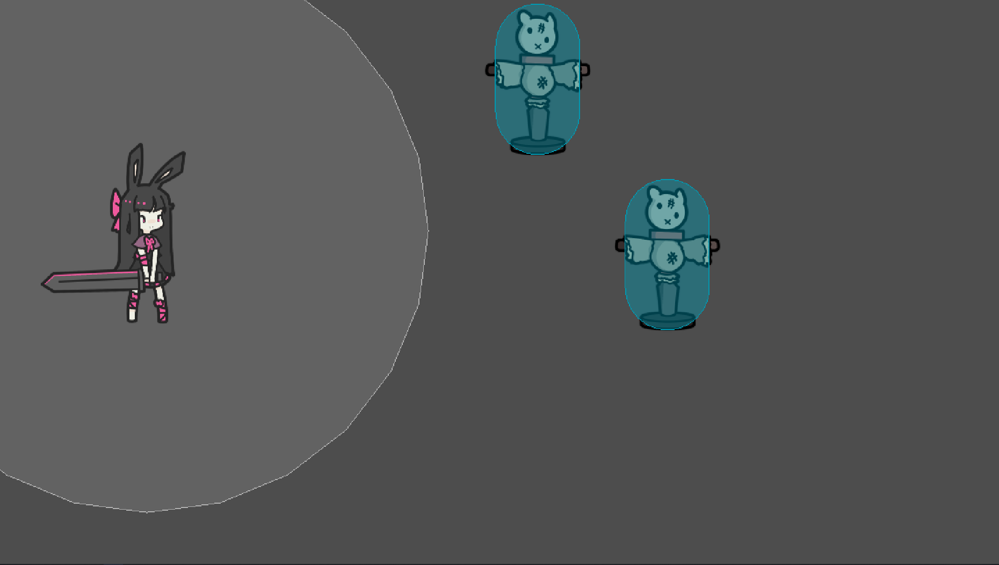  

For our project, we'll use **Canvas Item** so our scene automatically scales to the window size. After selecting **Canvas Item**:

<video src="canvas_item_resize.mp4" controls></video>

Notice how the scene now scales properly when you resize the window.

---

## Adjusting the Game Resolution
While you’re still in **Project Settings → Display → Window**, you can change the default resolution to something like **1920 × 1080**. This sets a baseline for a full HD layout, but if it’s too large for your monitor, feel free to choose a smaller resolution. You can also opt to start the game window in maximized or fullscreen mode here.

<video src="change_resolution.mp4" controls></video>

---

## Building the Lobby Scene
With our window behavior sorted out, it’s time to construct the “lobby” scene — a visually appealing space that greets the player. i
Here's our "reference":

<video src="analyze.mp4" controls></video>

### Observing the Reference
In many side-scrolling games, you might see separate images for the moon, buildings, distant mountains, etc. By layering these at different depths and potentially moving them at different speeds (parallax), you get a dynamic sense of distance. Here are some assets we'll be using:

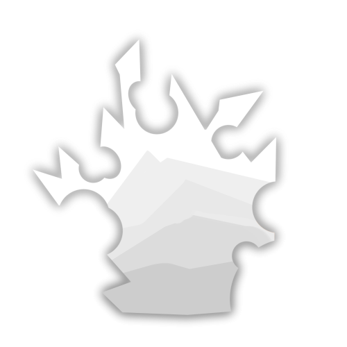

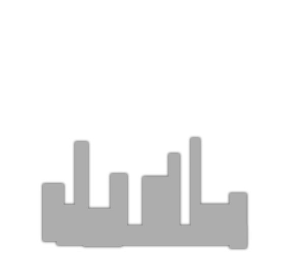
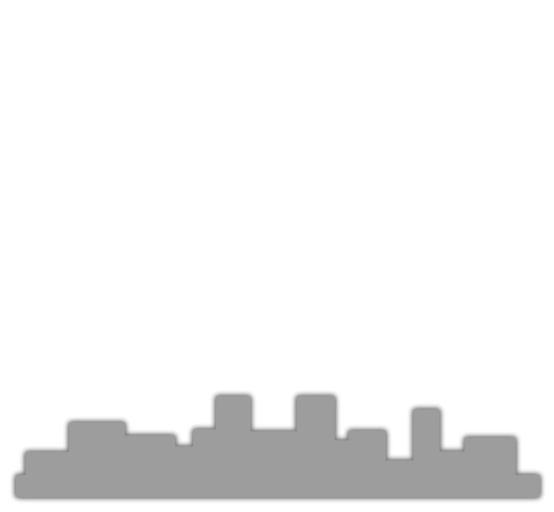
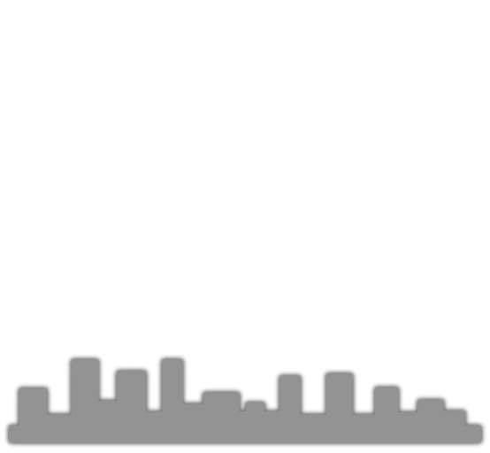

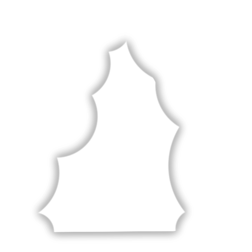
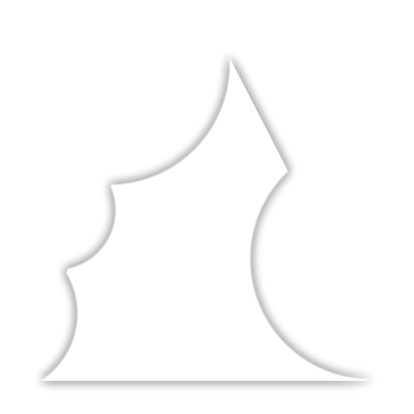

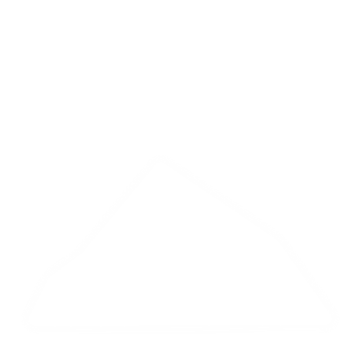

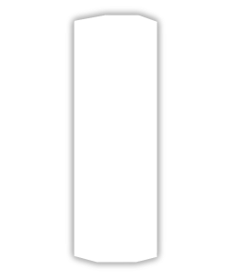
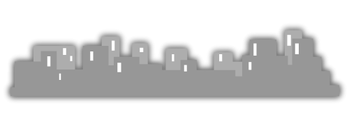

Here’s what our scene will look like when we’re done:

<video src="result.mp4" controls></video>

To keep things manageable, we’ll split building this level into two lessons. First, we’ll create the background. Later, we’ll add particle effects and some shader magic to enhance the atmosphere.

---

## Constructing the Background

### Importing Assets
Once you have all your images imported into Godot’s **FileSystem**, you can drag them into the **Scene** panel, or add a `Sprite2D` node and assign the image as its **Texture**.

<video src="import_assets.mp4" controls></video>

### Grouping Elements
Before positioning each sprite, create a parent `Node2D` named **Background**, and make each sprite a child of it. This keeps your scene organized and allows you to move or scale the entire background as one unit if needed.

<video src="grouping.mp4" controls></video>

### Arranging the Sprites
With your sprites in place, arrange them in the 2D editor to create a layered background. Farther elements (like mountains) should appear behind closer objects (like pillars or foreground details). You can control their visual stacking by changing the node order in the **Scene** panel.

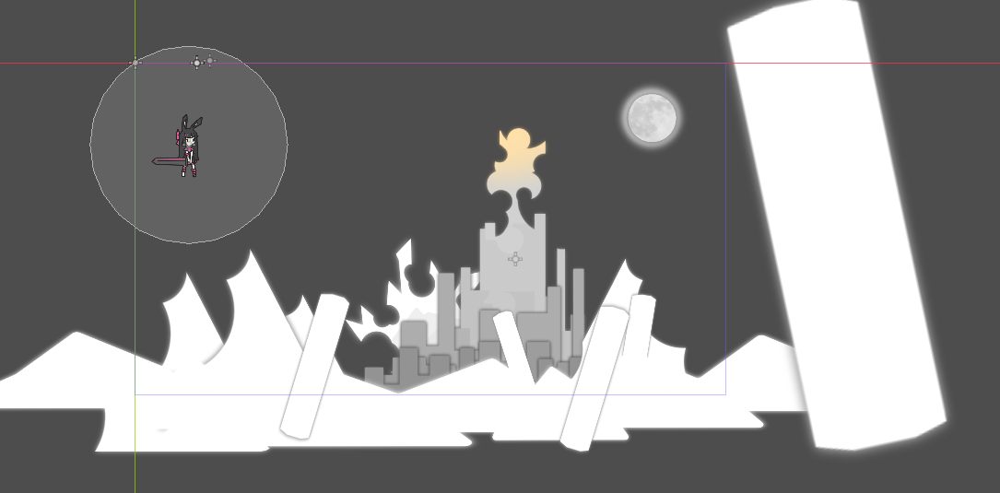

### Adjusting Colors
Each `Sprite2D` node has a **Modulate** property under **CanvasItem** in the Inspector. Tweak this to change the color tint or opacity. Subtle color shifts can help differentiate elements and give the scene a cohesive look.

<video src="changing_color.mp4" controls></video>  
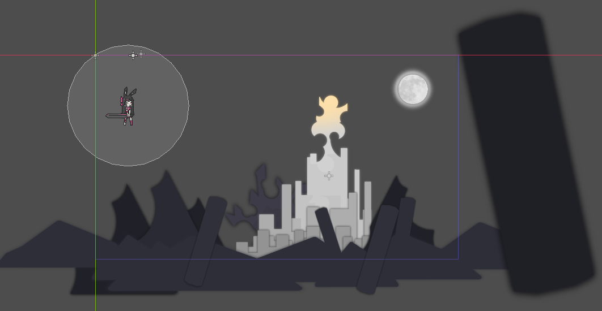

If you’re curious about the overall node layout, here’s an example:

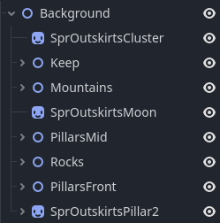

### Adding a Gradient Backdrop
A single solid color might feel too plain. Instead, add a `TextureRect` node as a child of **Background**. You can set its size to fill the screen and then apply a **Gradient** texture. Adjust the gradient’s colors in the Inspector to create a smooth transition (e.g., a dusk sky shifting from a deep purple at the top to a lighter blue at the horizon).

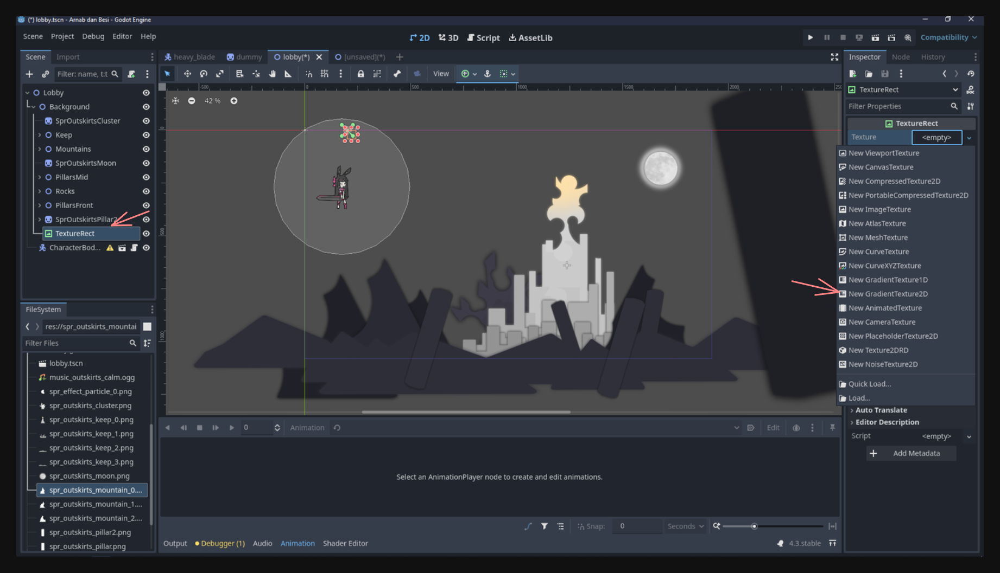

<video src="gradient_setting.mp4" controls></video>

With this, you’ve given your lobby scene a multi-layered backdrop. It sets the tone for the environment without requiring complex tilemaps or advanced modeling. Once you master layering and color coordination, you’ll find it much easier to create dynamic, immersive stages in your game.

---

## Where We Stand
By adjusting the window settings, scaling behavior, and layering background assets, your game now feels more like a cohesive experience rather than a bare-bones tech demo. This lobby scene serves as the perfect starting point for welcoming players into your game world.

**In the next lesson**, we’ll continue enhancing this area by adding:
- **Particle Effects** for more visual flair
- **Shaders (Godrays)** to create atmospheric lighting

Stay tuned! The fun truly begins as we see how small visual tweaks can transform an otherwise static background into a lively, compelling environment.
