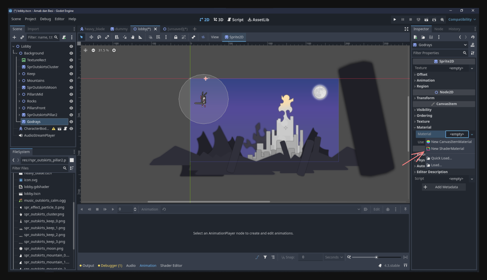
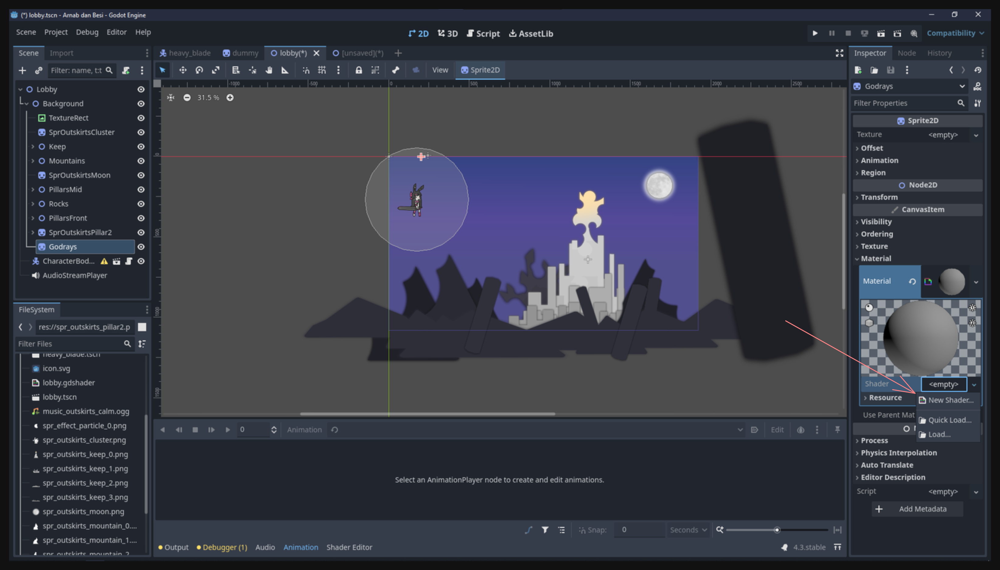
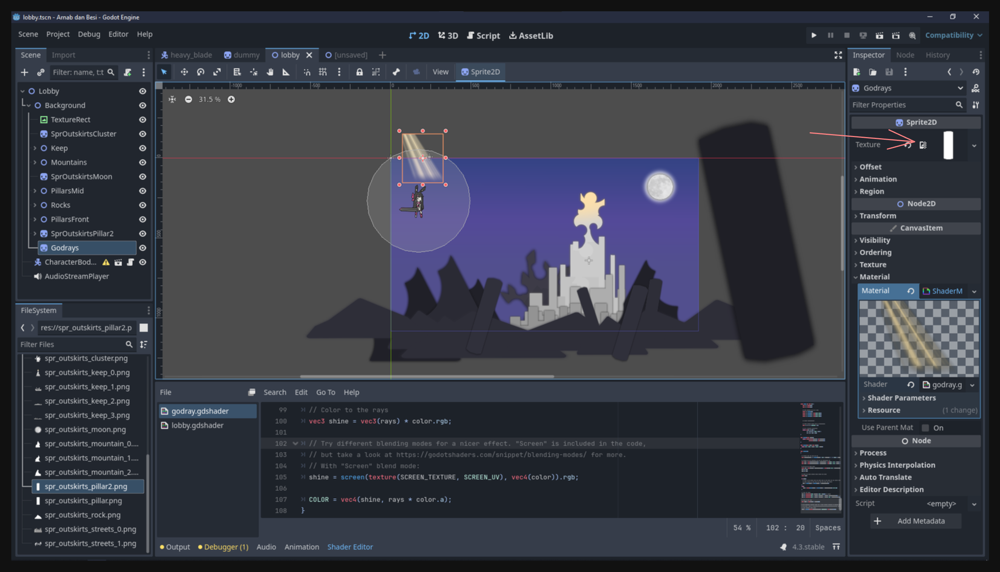
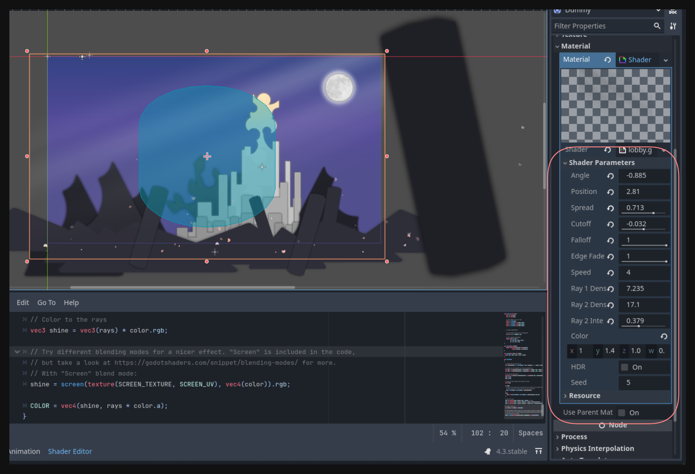

## Introduction

In the previous lesson, we enriched our level scene with background elements, but it still feels somewhat lifeless. One of the main reasons is the absence of movement. When there’s nothing moving, the scene can appear static and flat, no matter how detailed the artwork.

In this lesson, we’ll breathe more life into the level scene by introducing movement and additional visual enhancements:

- **Godray effect** via a shader, adding a soft beam of light that helps set the mood.  
- **Particle effects** to simulate drifting flower petals in the air, creating a gentle sense of motion and atmosphere.  
- **Parallax movement** on some background elements to give a feeling of depth.

By the end, your level scene could look like this:

<video src="result.mp4" controls></video>

## Shaders

A **shader** is a small program running on the GPU, used to control how objects appear on screen—affecting colors, textures, lighting, and more. In Godot, they allow you to go far beyond basic node properties for creating visual effects. While nodes are powerful building blocks (and come with many adjustable parameters), they can’t cover every possible appearance or effect. When you need something more specialized, you turn to shaders.

### Why Godot Needs Shaders

Godot provides a variety of nodes and properties to create complex visuals out of the box, but certain effects—like specialized lighting, distortion, or godrays—require more direct control over how each pixel is rendered. Rather than having a separate node for every conceivable effect (which would be unwieldy and impossible to maintain), Godot exposes shader functionality. This lets you craft unique looks without relying on stock effects.

> **Note:** Understanding how to write shaders from scratch can be very different from typical procedural programming. In this lesson, we won’t dive deep into the technical details of shader programming. We’ll simply use a premade shader to show you how shaders can be integrated into your scene. Deeper exploration of shader logic (including the shader language) will come in a future lesson.

### Adding a Godray Shader

1. **Create a new Sprite2D node**:  
   Add a `Sprite2D` (or another node that inherits from `CanvasItem`) as a child of your background node. This node will hold the material with our godray shader.

2. **Set up the ShaderMaterial**:  
   In the Inspector, look for a **Material** property (it should be under “CanvasItem Material”). Select **New ShaderMaterial**. This allows you to assign a custom shader to the sprite.  
   

3. **Create a new Shader**:  
   Under the new ShaderMaterial, create a **New Shader** and name it something like `godray`.  
   

4. **Paste the Shader Code**:  
   Clicking on your newly created shader opens the shader editor. Copy and paste the following premade code (sourced from [godotshaders.com](https://godotshaders.com/)). This shader simulates godrays.

   ```glsl
   /*
   Shader from Godot Shaders - the free shader library.
   godotshaders.com/shader/god-rays

   Feel free to use, improve and change this shader according to your needs
   and consider sharing the modified result on godotshaders.com.
   */

   shader_type canvas_item;

   uniform float angle = -0.3;
   uniform float position = -0.2;
   uniform float spread : hint_range(0.0, 1.0) = 0.5;
   uniform float cutoff : hint_range(-1.0, 1.0) = 0.1;
   uniform float falloff : hint_range(0.0, 1.0) = 0.2;
   uniform float edge_fade : hint_range(0.0, 1.0) = 0.15;

   uniform float speed = 1.0;
   uniform float ray1_density = 8.0;
   uniform float ray2_density = 30.0;
   uniform float ray2_intensity : hint_range(0.0, 1.0) = 0.3;

   uniform vec4 color = vec4(1.0, 0.9, 0.65, 0.8);

   uniform bool hdr = false;
   uniform float seed = 5.0;
   uniform sampler2D SCREEN_TEXTURE: hint_screen_texture, filter_linear_mipmap;

   float random(vec2 _uv) {
       return fract(sin(dot(_uv.xy,
                            vec2(12.9898, 78.233))) *
           43758.5453123);
   }

   float noise (in vec2 uv) {
       vec2 i = floor(uv);
       vec2 f = fract(uv);

       float a = random(i);
       float b = random(i + vec2(1.0, 0.0));
       float c = random(i + vec2(0.0, 1.0));
       float d = random(i + vec2(1.0, 1.0));

       vec2 u = f * f * (3.0-2.0 * f);

       return mix(a, b, u.x) +
               (c - a)* u.y * (1.0 - u.x) +
               (d - b) * u.x * u.y;
   }

   mat2 rotate(float _angle){
       return mat2(vec2(cos(_angle), -sin(_angle)),
                   vec2(sin(_angle), cos(_angle)));
   }

   vec4 screen(vec4 base, vec4 blend){
   	return 1.0 - (1.0 - base) * (1.0 - blend);
   }

   void fragment()
   {
   	vec2 transformed_uv = ( rotate(angle) * (UV - position) )  / ( (UV.y + spread) - (UV.y * spread) );

   	vec2 ray1 = vec2(transformed_uv.x * ray1_density + sin(TIME * 0.1 * speed) * (ray1_density * 0.2) + seed, 1.0);
   	vec2 ray2 = vec2(transformed_uv.x * ray2_density + sin(TIME * 0.2 * speed) * (ray1_density * 0.2) + seed, 1.0);

   	float cut = step(cutoff, transformed_uv.x) * step(cutoff, 1.0 - transformed_uv.x);
   	ray1 *= cut;
   	ray2 *= cut;

   	float rays;
   	if (hdr){
   		rays = noise(ray1) + (noise(ray2) * ray2_intensity);
   	}
   	else{
   		 rays = clamp(noise(ray1) + (noise(ray2) * ray2_intensity), 0., 1.);
   	}

   	rays *= smoothstep(0.0, falloff, (1.0 - UV.y));
   	rays *= smoothstep(0.0 + cutoff, edge_fade + cutoff, transformed_uv.x);
   	rays *= smoothstep(0.0 + cutoff, edge_fade + cutoff, 1.0 - transformed_uv.x);

   	vec3 shine = vec3(rays) * color.rgb;

   	shine = screen(texture(SCREEN_TEXTURE, SCREEN_UV), vec4(color)).rgb;

   	COLOR = vec4(shine, rays * color.a);
   }
   ```

5. **Assign a Texture (Optional)**:  
   If you want the shader to blend with a particular texture, make sure to assign one to the sprite’s `Texture` property.  
   

6. **Resize the Sprite**:  
   Adjust the Sprite2D node to cover your intended area on the screen—often the entire screen for a full-scene effect.

7. **Tweak Shader Properties**:  
   Experiment with the uniforms (`angle`, `spread`, `color`, etc.) to get a subtle or pronounced godray effect. The goal is often to have it faintly visible, yet not so bright that it overpowers other visuals.  
   

Once this is in place, you’ll have a gentle, atmospheric beam of light enhancing your scene.

## Particles

Next, let’s add **particles** to further enhance the sense of movement and atmosphere—especially useful for things like drifting petals or floating dust motes.

### Why Use Particles?

Godot’s built-in particle system allows you to quickly create complex effects without needing to animate every single object manually. By adjusting various properties in the **ParticleProcessMaterial**, you can control how many particles spawn, where they appear, how they move, and when they disappear.

### Creating a Petal Effect

1. **Add GPUParticles2D**:  
   Create a `GPUParticles2D` node (child of your background node, or wherever you’d like the effect).

2. **Assign a Texture**:  
   Particles default to a 1×1 square, so give them a texture to shape them into something meaningful. For instance, here’s a small flower petal sprite:  
   

3. **Use a ParticleProcessMaterial**:  
   In the `Process Material` property of `GPUParticles2D`, create a new **ParticleProcessMaterial**. You’ll manage most of your particle behaviors there.

4. **Adjust Key Properties**:  
   - **Amount**: Set how many particles you want at once (e.g., `50` for a gentle flurry).  
   - **Emission Shape**: Changing to `Box` lets you spread particles across a rectangular region. Set `Emission Box Extents` wide enough to fill the screen or any desired area.  
   - **Velocity**: Under `Velocity`, adjust the initial velocity range to vary how quickly particles travel. You might set it from 0 to 500 to give some random slow or fast movement.  
   - **Direction**: Tweak this for angled movement (e.g., `x = 15, y = -15`) so petals drift diagonally.  
   - **Angular Velocity**: Let them spin by enabling `Angular Velocity` and specifying a range (e.g., `100` to `400`), disable z flag to make the particle rotate.  
   - **Scale**: Randomize the size with minimum/maximum scale (e.g., `0.2` to `1.2`) for a sense of depth.  
   - **Color / Alpha**: Fade out each petal over time by adjusting the color curve so alpha gradually goes from 100% to 0%.

Feel free to experiment. There’s a lot of power hidden in the particle editor. Here’s an example result of a floating petal effect:

<video src="particles.mp4" controls></video>

## Adding Movement to the Background

Previously, you might recall adding a large black pillar or other elements outside the scene’s visible area. A simple way to animate these background pieces is using **AnimationPlayer**. Even minimal right-to-left movement can create a solid sense of parallax and depth.

The core steps for AnimationPlayer have been covered in prior lessons, so consider this a creative exercise:

- Create an animation track for your background node.  
- Keyframe the position to make it scroll subtly across the screen.

## Last Touch: Background Music

Finally, we can complement the visuals with **background music** (BGM). In a 2D game, you can choose between `AudioStreamPlayer2D` (for positional audio) or a plain `AudioStreamPlayer` (for non-positional global audio).

Since this is BGM, the latter is sufficient:

1. **Add an AudioStreamPlayer** node to your scene.  
2. **Assign the Music File** by dragging the `.ogg` or `.wav` file into the `Stream` property.  
3. **Enable Autoplay** so it starts when the scene is loaded.  

For example, here’s a snippet of the calm music used:

<audio src="music_outskirts_calm.ogg" controls></audio>

## Conclusion

By combining subtle godrays, drifting petals, gentle background movement, and a calm BGM track, your scene now feels more vibrant and immersive. You’ve taken a static image and turned it into something that hints at a living, breathing world—an essential step in making your game visually appealing.

Enjoy experimenting with these premade effects and see how they can transform the mood of your game scenes.

See you in the next lesson!
