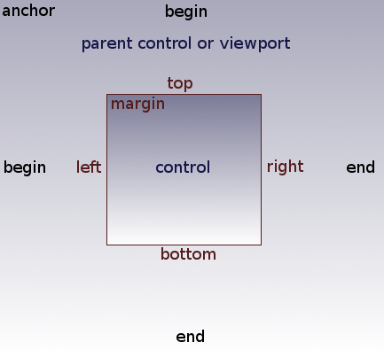
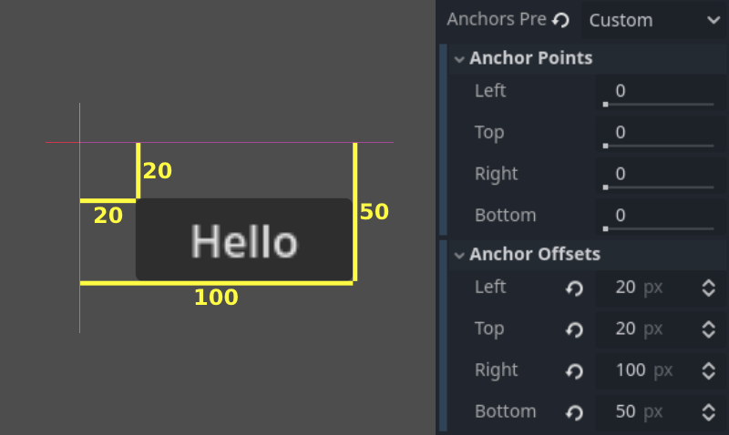

## Introduction
In a game, the user interface (UI) often serves as a bridge between the player and the game's world. It provides feedback to the player, displays information like health bars, cooldowns, and menus, and helps guide interactions. 

Godot offers a comprehensive UI system through its Control nodes, which support flexible layouting, styling, and interaction patterns. Throughout this lesson, we'll begin by covering the conceptual foundations you need to feel comfortable working with Godot's UI. Then, we’ll move on to a practical example of creating a simple character UI. 

This is the start of a more “theory-heavy” topic before we get our hands dirty with actual UI implementations. By the end, you’ll be able to place and style basic UI elements in your game and have a good grasp on how Control nodes manage positioning and appearance.

> **Note on shaders**: Although Godot supports shaders that can be used for advanced UI effects—like custom transitions, complex highlights, or special visual treatments—we won’t delve into them in this lesson (we're still afraid of shaderss waaahh 🗣️). Shaders are incredibly powerful, and Godot needs them in scenarios where built-in material properties or simple styling options aren’t sufficient. However, teaching shaders in detail right now would distract from understanding the foundational layout, styling, and interaction systems. We’ll revisit shaders in a future chapter once you’re comfortable with the basics of Godot’s UI.

## What does it take to learn how to make a UI?
Just like in web or mobile development, you can think of Godot’s UI in terms of three key pillars:

1. **Layouting system** – How UI elements (controls) are positioned and sized.  
2. **Style system** – How the UI elements look, including themes and visual customization.  
3. **Interaction system** – How the user (player) interacts with these elements, such as clicking buttons or typing text.  

If you’re familiar with web technologies, it’s similar to learning HTML/CSS/JS layout models (like flexbox or grid), styling with CSS, and using event handlers for interactivity. In Godot, you learn equivalent systems (the specifics are just different in naming and usage).

## Godot UI System
Godot’s UI is built on **Control** nodes, which belong to the “green” category in the Node list. Control nodes generally serve one of two purposes: displaying content or managing layout. Let’s break them down:

### Content
These are the UI nodes that primarily show information to the user or allow user interaction. Examples include:
- **Button**: Displays text and/or an icon, and can respond to user clicks.
- **Label**: Shows text.
- **TextureRect**: Displays images or sprites.

Each content-type node comes with properties for controlling its appearance (e.g., a `Button` has `text` and `icon` properties).

### Layout
Layout nodes don’t usually display anything visually on their own. Instead, they organize and position other Control nodes. Examples include:
- **VBoxContainer**: Arranges child nodes vertically.  
- **HBoxContainer**: Arranges child nodes horizontally.  
- **GridContainer**: Arranges child nodes in a grid formation.  

By using layout nodes, you can easily maintain consistent spacing and positioning for your UI elements, without having to manually “pixel-push” each component.

## Layouting System
A robust layouting system is essential for creating interfaces that look good on multiple screen sizes and aspect ratios. Godot’s Control nodes rely on anchors and offsets to adapt and reflow in different resolutions or device orientations.

### Size and Anchor
If your game only ran on a single device with a fixed resolution, you could simply place each UI element at a specific position and size, and be done with it. But most games need to adapt to multiple devices (e.g., phones, tablets, various monitors).

**Anchors** and **Offsets** let you specify how a UI element resizes or repositions relative to its parent or the viewport.



1. **Anchor**: A value between 0.0 and 1.0 for each edge (left, right, top, bottom), representing the fraction of the parent or viewport’s dimension.  
2. **Offset**: A pixel-based distance from that anchor.

By combining anchors and offsets, you can ensure that elements scale or move correctly when the screen size changes. For example, setting your right anchor to `1.0` and your left anchor to `0.0` would make the control stretch horizontally across the entire parent. Meanwhile, negative offsets can place UI elements partially outside the anchor boundary if needed.



> **Tip**: Use the **Anchor Presets** menu in the toolbar to quickly configure common anchor and offset patterns, such as aligning a Control node to the top-left or stretching it to fill the entire parent.


### Automatically resizing for different screens
When you give your Control node more flexible anchors—for example, the top at `0.0` and bottom at `1.0`—the node will try to span from top to bottom of the parent. Combining that with horizontal anchors from `0.0` to `1.0` can make the Control scale in both dimensions. This is extremely helpful if you’re designing for multiple screen sizes and want dynamic resizing.

## Styling
Styling in Godot is usually less complex to grasp than layout. Once you understand where to apply theme settings or style overrides, you can quickly make your UI look cohesive.

### Theme Override
Every Control node has a **Theme Override** property. This lets you customize the look of just that node by overriding its fonts, colors, background images, etc. You can do this directly in the Inspector under the “Theme Overrides” section.


### Theme Resources
For more consistent styling across multiple UI elements, you can create a **Theme resource**. Assigning it to a Control node’s `theme` property means that node (and its children, if configured to inherit the theme) will share the same styles.

When you edit a Theme resource, you’ll see a broad list of possible UI elements you can customize. This approach involves more initial setup but pays off by giving your entire game a uniform look. You can reuse the same Theme file across many scenes and nodes.


## Building our character UI
Let’s consider this reference example:

<video src="reference_ui.mp4" controls></video>

In the footage, you see:
- Static icons representing attacks and skills.
- Icons become transparent when the character attacks.
- Icons darken when on cooldown.
- Icons glow when pressed.
- A loading indicator appears during global cooldown.

It can feel overwhelming when seen all at once, but if you break it down, it’s simply a collection of images and labels managed by layout containers, plus some interactive states and feedback.

### Placing a static icon
Let's start small by displaying a static icon with a `TextureRect` node. This node simply shows a texture:

```plaintext
spr_move_hblade_0.png
spr_move_hblade_1.png
spr_move_hblade_2.png
spr_move_hblade_3.png
```

You can drag one of these textures into the `TextureRect` node’s texture property:


At first, the icon might appear too large or in the wrong position. You could scale or manually adjust it, but that gets messy fast. Instead, we rely on the layout system.

### Using layout containers
Add a `VBoxContainer` to your scene and place the `TextureRect` as a child. The container automatically arranges any child Control nodes vertically. You can’t manually “drag” the TextureRect around in the editor anymore, but in exchange, the UI becomes responsive and neatly structured.


You can adjust spacing between items via the container’s `separation` property, often found under the “Theme Overrides” in the Inspector:


### Adding a label
Suppose you want to display the player’s name above their character. You can do this by adding a `Label` node. Then you can configure its text and style. Just like before, try to keep layout containers in mind so the label remains neatly positioned rather than floating randomly.


Once you add these elements, you’ll have a simple UI anchored near the character. You can see the static icons and label in the preview:

<video src="static_ui.mp4" controls></video>

## Where we go from here
Notice how some UI elements (like skill icons) appear to be following the character, while others look “anchored” to the screen. In the next lessons, we’ll explore how to arrange UI in different layers, so you can decide if something should stay pinned on the screen (like a health bar at the top) or move around with the character.

We’ve covered a lot of textual information in this lesson—principles of layout, how to anchor your elements, and how to set up basic styling. Take some time to experiment with these fundamentals before moving on.

This lesson is quite theory heavy so we'll end it here to avoid overloading your brain.

## Conclusion
Godot’s UI system uses Control nodes for everything from simple text labels to elaborate menus. Understanding how anchoring, offsets, and containers work sets you up for building flexible interfaces that adapt to multiple device sizes. Once you’ve got your layout stable, you can customize the look and feel via theme overrides or global theme resources.

While we’ve introduced the basics of placing, sizing, and styling UI elements, there’s plenty more to discover, like using signals for interaction or applying advanced effects with shaders. For now, focus on mastering these core concepts. In the next lesson, we’ll expand on more dynamic or screen-level UI placements and continue to refine our game’s interface.