# Getting Started with Godot 4

Hai teman-teman, selamat datang di pelajaran pertama kita. Sebelum kita mulai kita siapkan dulu semuanya.

## Download Godot

Pertama-tama, kita download Godot engine:

1. Buka situs resmi Godot (https://godotengine.org/)
2. Klik tombol **Download**
3. Pilih versi terbaru Godot 4.x sesuai OS yang kamu pakai (Windows, Mac, atau Linux)
4. Download versi **Standar** (kecuali kamu memang mau pakai .NET buat C#)
5. Setelah selesai, ekstrak file ke folder yang mudah kamu akses

Gampang, kan? Godot itu self-contained, jadi nggak perlu install.  
> Catatan: Akan ada dua file executable, **Godot_v4.3-stable_win64.exe** dan **Godot_v4.3-stable_win64_console.exe**. Keduanya bisa dipakai.
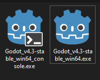

## Creating Your First Project

Sekarang, kita create project baru:

1. Buka file executable Godot yang sudah kamu download
2. Kamu akan melihat tampilan **Project Manager**  
   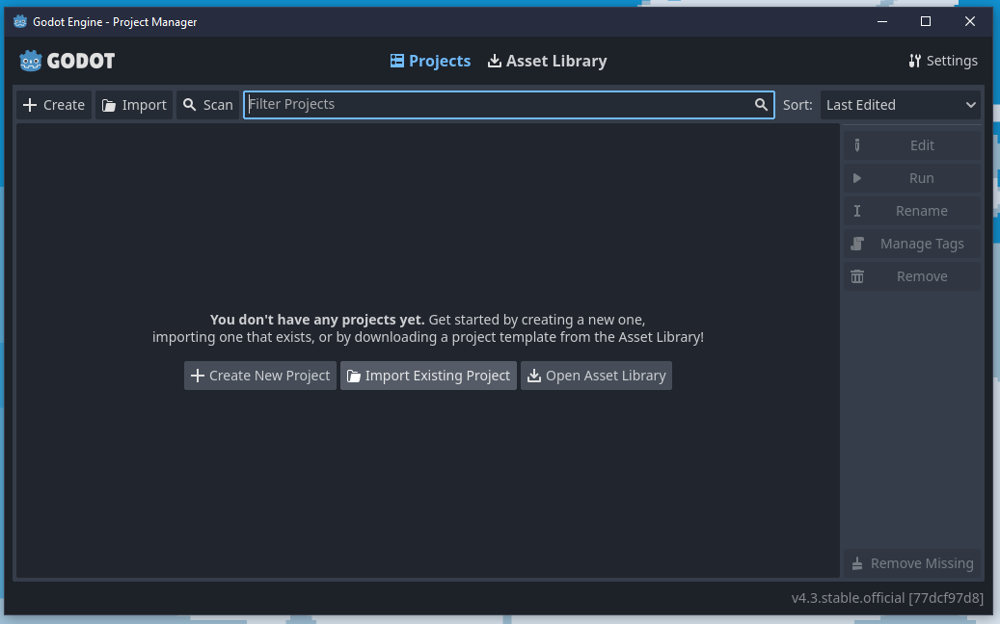
3. Klik **"Create New Project"**  
   
4. Beri nama project (misalnya aku pakai "Arnab dan Besi", tapi kamu bebas pilih nama lain)
   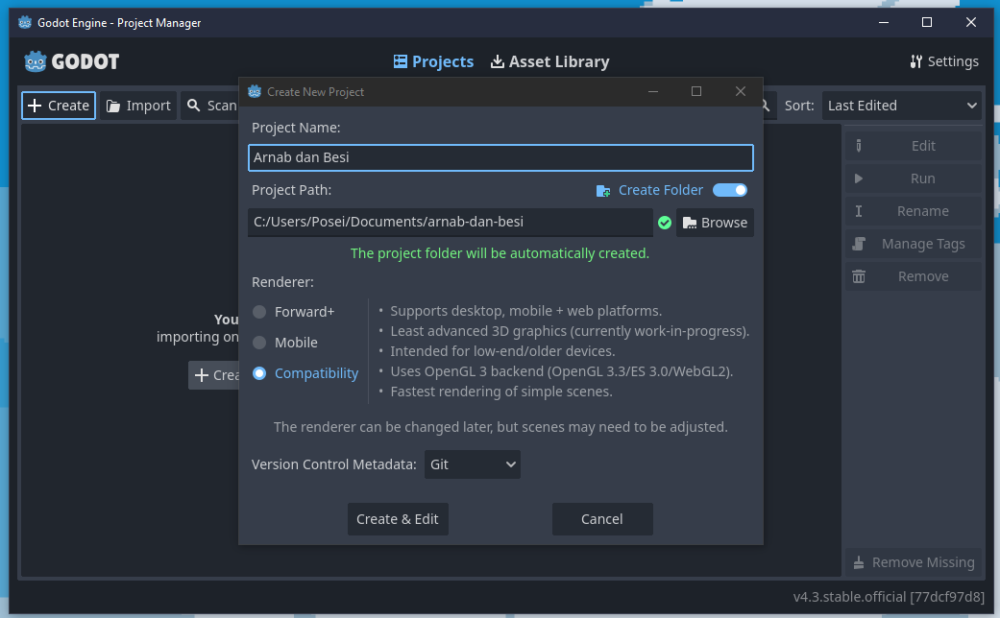
5. Tentukan lokasi penyimpanan project  
   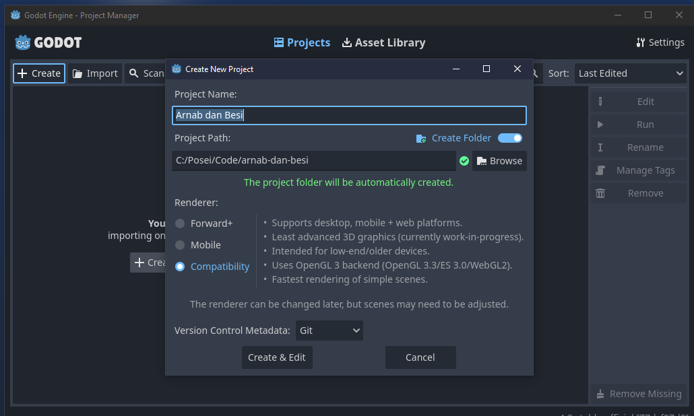
6. Biarkan pengaturan renderer sesuai default
7. Klik **"Create & Edit"**  
   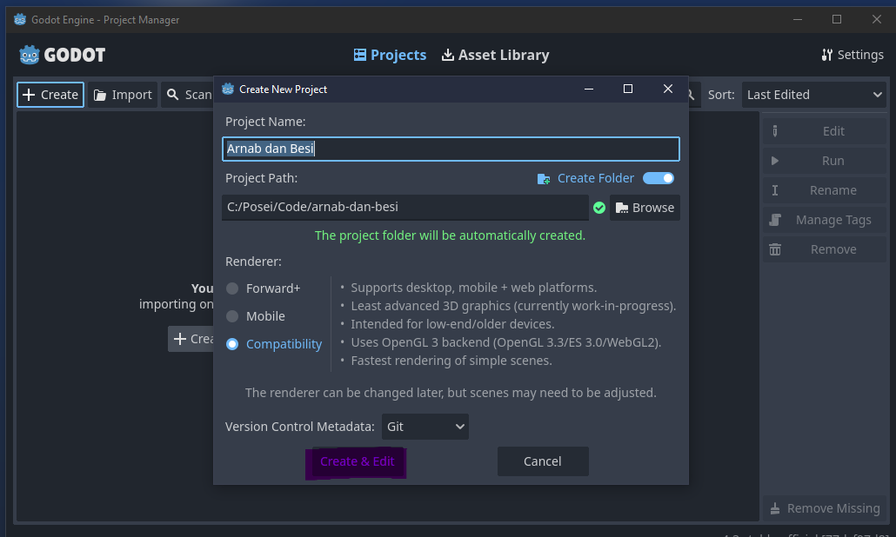

Kalau ada error, jangan ragu untuk tanya di Discord.

## Understanding the Editor

Pas pertama kali buka editor Godot, kamu bakal lihat beberapa panel. Sebenarnya, tampilannya lebih simpel dari yang terlihat. Ini area-area penting yang perlu kamu tahu:

- **Left Panel**: Di sini ada dua tab:
  - **Scene**: Menampilkan hierarki scene (nanti kita bahas tentang scenes dan nodes)
  - **FileSystem**: Menampilkan file dan folder project  
  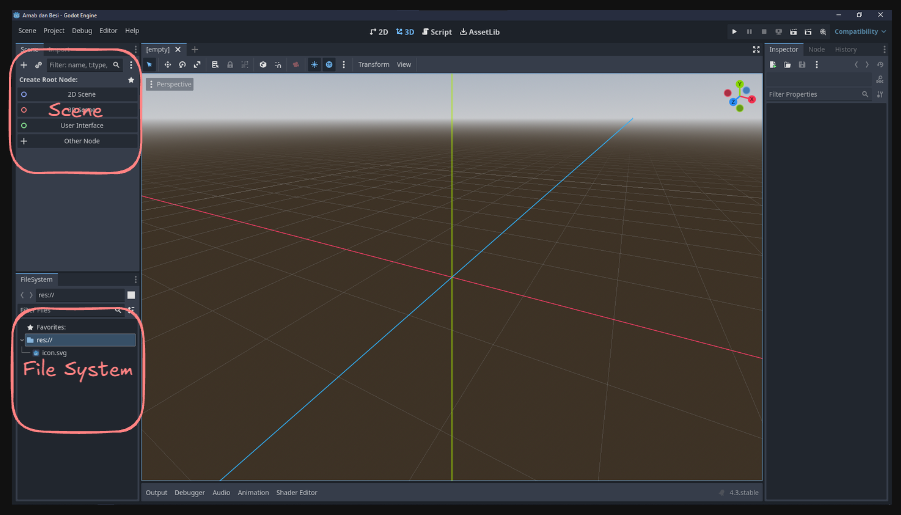

- **Right Panel**: Menampilkan properti dari node yang sedang kamu pilih  
  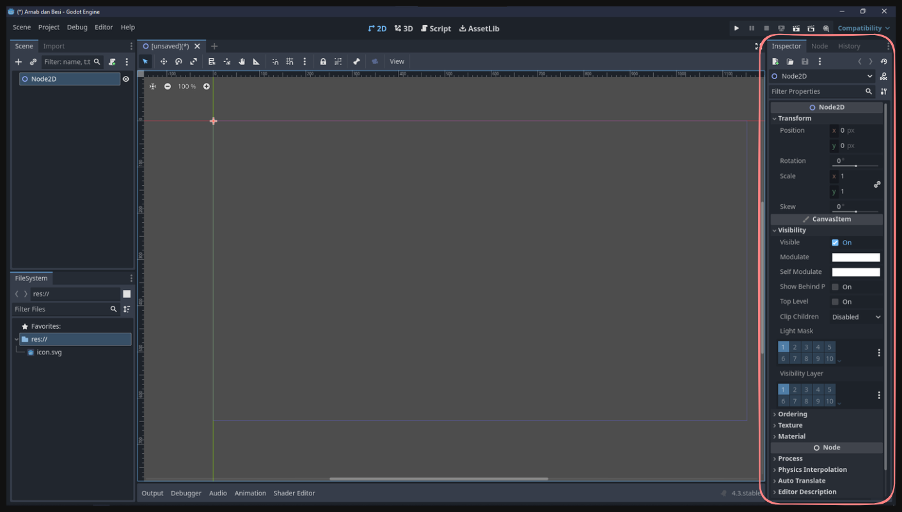

- **Center Area**: Ini adalah area kerja utama buat ngeliat dan ngedit scene  
  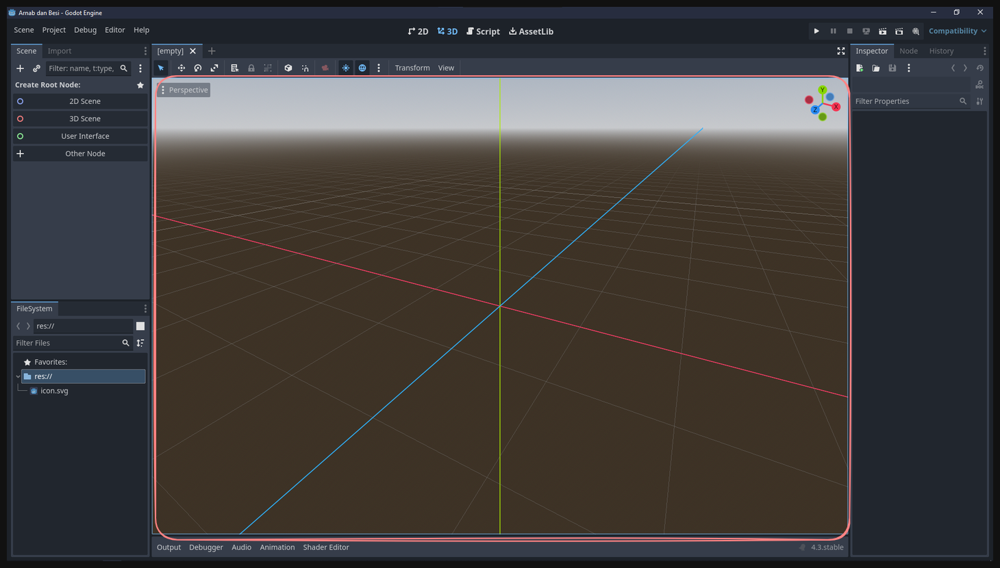

## Nodes and Scenes: The Building Blocks

Di Godot, semua dibangun dari **nodes** dan **scenes**. Kita pelajari konsep ini lewat contoh praktis.

### Example: Character Scene

Coba tonton video gameplay ini:
<video src="gameplay_example.mp4" controls></video>

Melihat karakter ini, mungkin kamu penasaran:
- Gimana struktur scene-nya?
- Node apa saja yang dipakai buat menghasilkan behavior tersebut?

Santai, nanti kamu akan paham seiring kamu belajar lebih dalam tentang nodes dan scenes.

### Scene Structure

Ini cara scene karakter distruktur:


Scene ini pakai **CharacterBody2D** sebagai root node-nya, yang ngatur pergerakan dan physics. Di dalamnya ada beberapa child node:

| Node Type            | Fungsi                                                    |
|----------------------|-----------------------------------------------------------|
| Sprite2D             | Menampilkan tampilan karakter                             |
| CollisionShape2D     | Menentukan bentuk fisik untuk collision detection         |
| AnimationPlayer      | Mengontrol animasi karakter                               |
| Area2D               | Mengatur area serangan karakter                           |
| AudioStreamPlayer2D  | Mengelola efek suara                                      |

> Catatan: Di screenshot, kamu bisa lihat **CharacterBody2D** dinamai *HeavyBlade* dan **Area2D** dinamai *BasicAttackHitbox*. Kita bisa ganti nama node supaya lebih jelas fungsinya, karena satu scene bisa punya beberapa node dengan tipe yang sama.

Struktur ini menunjukkan bahwa setiap node punya peran masing-masing dan bersama-sama menciptakan behavior yang kompleks—ibarat main LEGO, tiap potongan punya fungsinya dan kalau digabung jadi sesuatu yang lebih keren.

## Creating Your First Character Scene

Ikuti langkah-langkah berikut buat bikin scene karakter:

### 1. Create a New Scene

1. Di tab **Scene**, kamu akan melihat scene kosong.
2. Buat scene baru dengan menambahkan root node.
3. Klik **"Other Node"** dan cari **"CharacterBody2D"**  
   > Catatan: Nanti kita bahas kenapa pakai **CharacterBody2D** di pelajaran berikutnya. Untuk sekarang, cukup tahu kalau node ini pas buat karakter yang bisa dikontrol.
4. Klik **"Create"** untuk menambahkannya sebagai root node  
   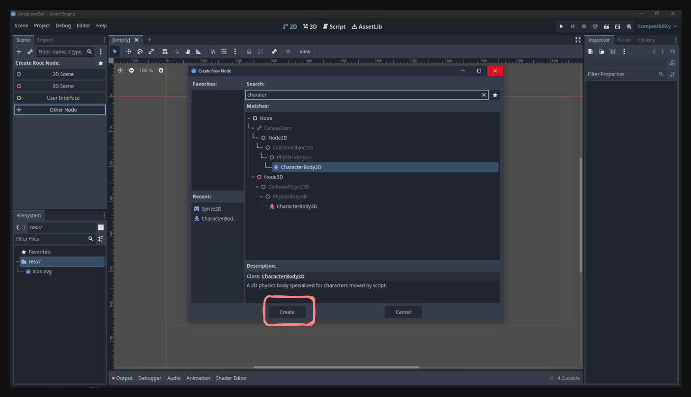

Sekarang, scene baru kamu sudah punya **CharacterBody2D** sebagai root node, tapi kita harus simpan dulu.

### 2. Save Your Scene

1. Buka menu **Scene → Save Scene** (atau tekan Ctrl+S)
2. Beri nama scene (misalnya, "heavy_blade.tscn")  
   > Catatan: **.tscn** adalah ekstensi file scene di Godot. Semua scene kamu akan memakai ekstensi ini.
   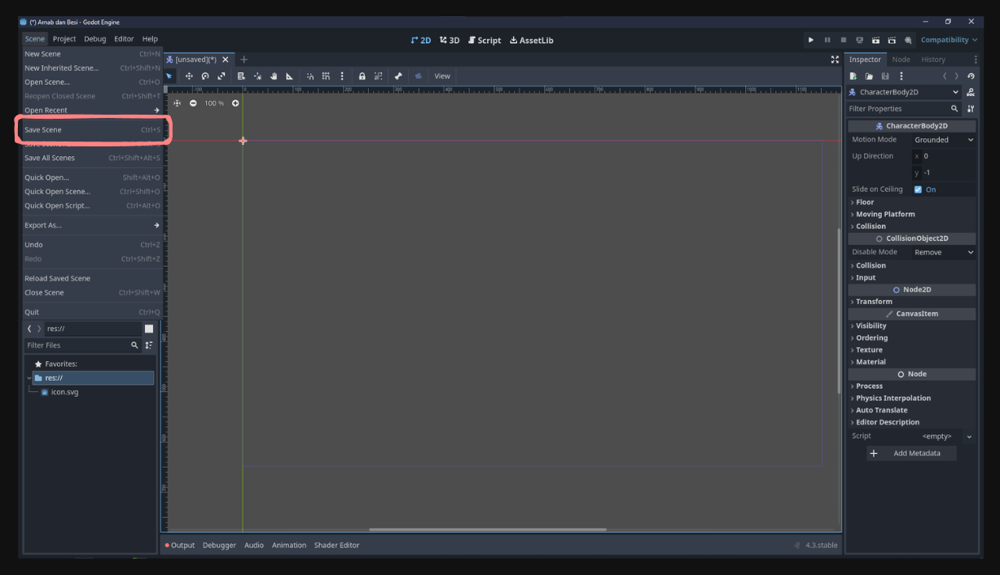

Setelah root node ada dan scene tersimpan, kita bisa mulai nambahin komponen buat bangun karaktermu.

### 3. Add a Sprite

1. Pilih node **CharacterBody2D**.
2. Klik ikon **'+'** atau tekan Ctrl+A buat nambah child node  
   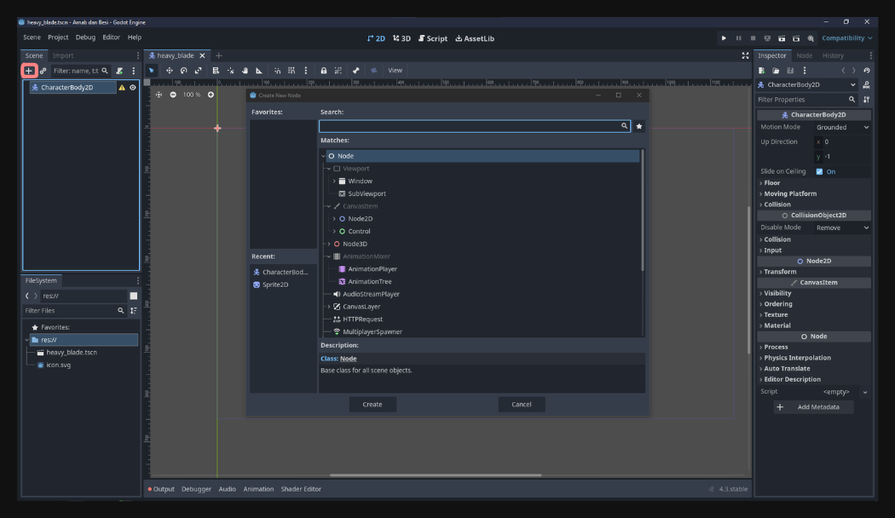
3. Cari dan pilih **"Sprite2D"**  
   > Catatan: Sprite adalah gambar 2D yang mewakili objek di game.
   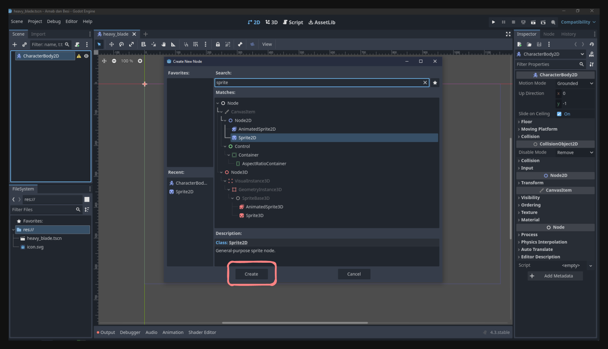

Sekarang, kamu sudah punya node **Sprite2D** sebagai child dari **CharacterBody2D**, tapi belum ada tampilan karena belum diberi gambar.

### 4. Configure the Sprite

1. Pilih node **Sprite2D**.
2. Di panel **Inspector**, cari properti **Texture**  
   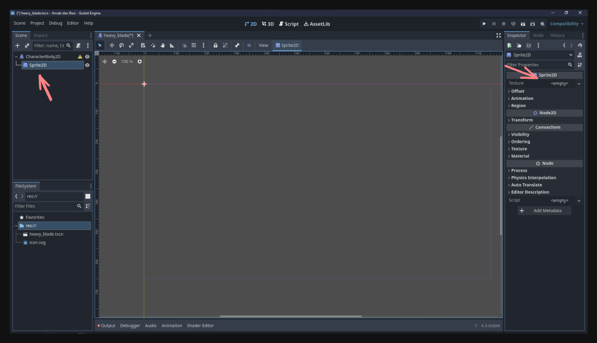
3. Tambahkan sprite sheet karakter kamu:
   - Drag file gambar langsung ke field **Texture**
   - Atau klik field tersebut dan pilih file gambarnya  
   > Catatan: Ini adalah sprite sheet yang akan kita pakai:
   

   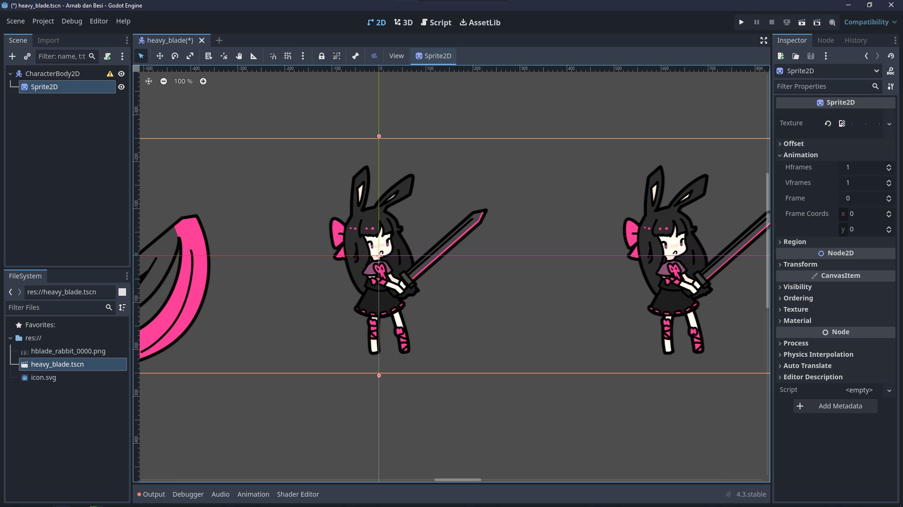
4. Atur sprite sheet:
   - Di bagian **Animation**, set **Hframes** ke 23 (frame horizontal)
   - Set **Vframes** ke 1 (frame vertikal)  
   > Ini membagi sprite sheet menjadi frame-frame individual. Sprite sheet ini punya 23 frames yang tersusun horizontal, jadi Godot perlu tahu cara membaginya.
   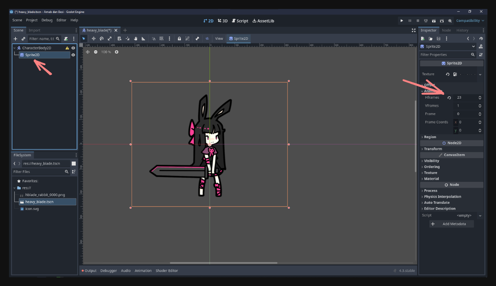
5. Atur **Scale** jadi 0.5:
   - Di bagian **Transform**, set **Scale** ke 0.5  
   > Karena sprite sheet ini agak besar buat ukuran default.
   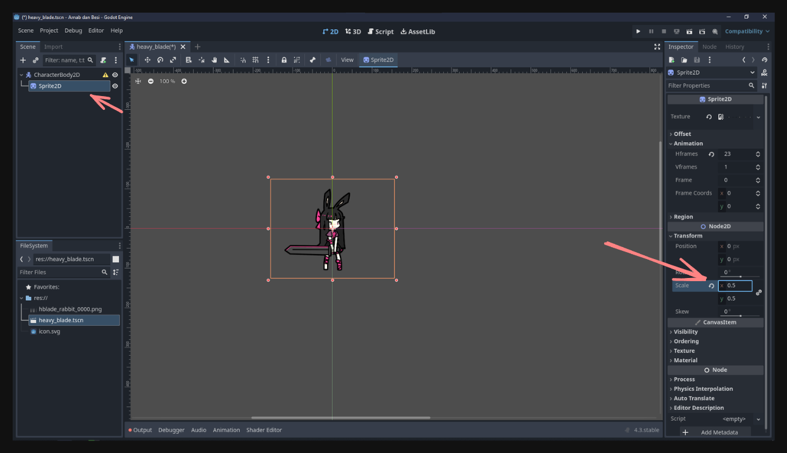

### 5. Test Your Scene

1. Pindahkan karaktermu ke tengah layar dengan menggeser root node.
2. Tekan **F6** atau klik tombol **"Play Scene"** (ikon film) buat nyobain scene  
   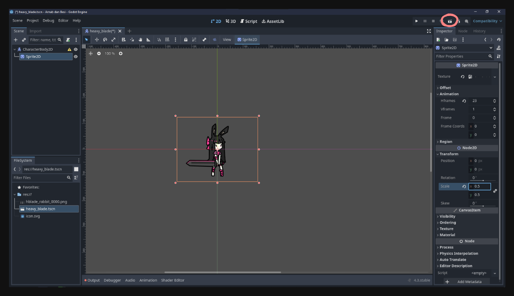
3. Karaktermu bakal tampil di jendela game  
   
   > Catatan: Kalau karaktermu nggak muncul, pastikan posisinya di dalam area tampilan jendela game dan yang kamu geser adalah root node, bukan sprite node.
   
   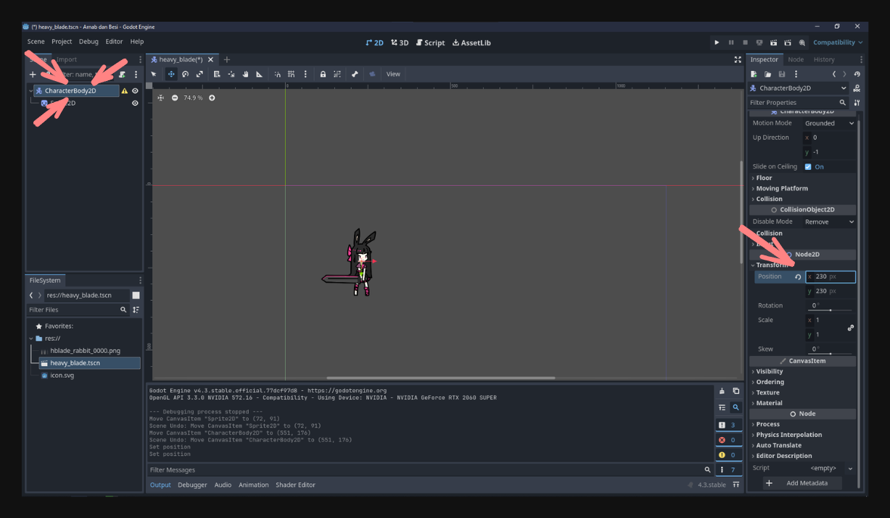  
   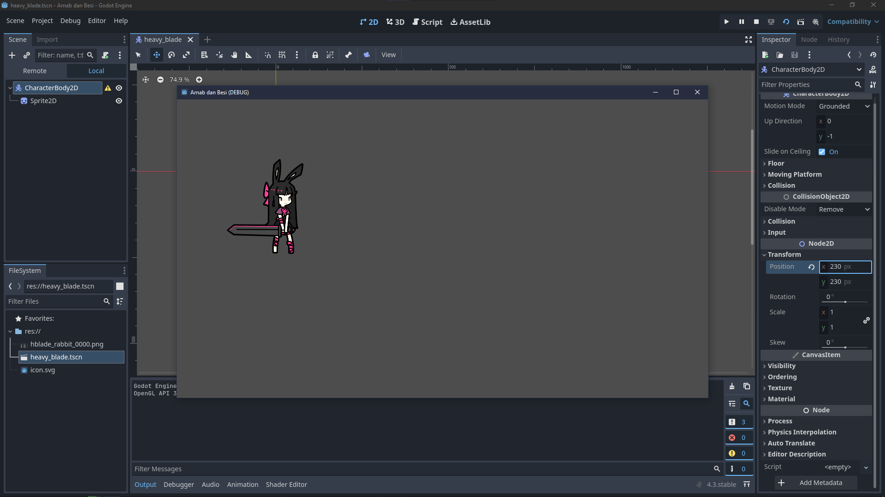

## Manipulating Scenes and Nodes

Sekarang kamu sudah punya scene dasar, tapi masih statis. Walaupun kamu bisa atur properti seperti posisi secara manual di editor, gimana biar scene bergerak saat game jalan?

Jawabannya adalah script! Script ngasih tahu node: apa yang harus dilakukan saat game dijalankan. Misalnya, pergerakan karakter dilakukan dengan mengubah properti **position** seiring waktu sesuai input pemain.

Dengan script, kamu bisa:
- Mengubah properti node secara real-time
- Merespons aksi pemain (seperti input keyboard/mouse)
- Mengatur aturan dan behavior game

Aku anggap kamu sudah paham dasar-dasar pemrograman (variabel, fungsi, alur logika, dll.), jadi aku nggak akan jelasin dasar-dasar **GDScript** (bahasa script Godot) di sini. Kalau kamu masih baru, sebaiknya pelajari dulu dasarnya.

Kalau butuh bantuan, tinggal tanya aja di Discord.

### How Scripts Work in Godot

Di Godot, kamu bisa lampirkan script ke setiap node dalam scene. Biasanya, script dilampirkan ke root node kecuali ada alasan khusus buat lampir ke child node.

Untuk melampirkan script:
- **Klik kanan** pada node, lalu pilih **"Attach Script"**, atau
- **Pilih node** dan klik ikon **'+'** di pojok kanan atas.
   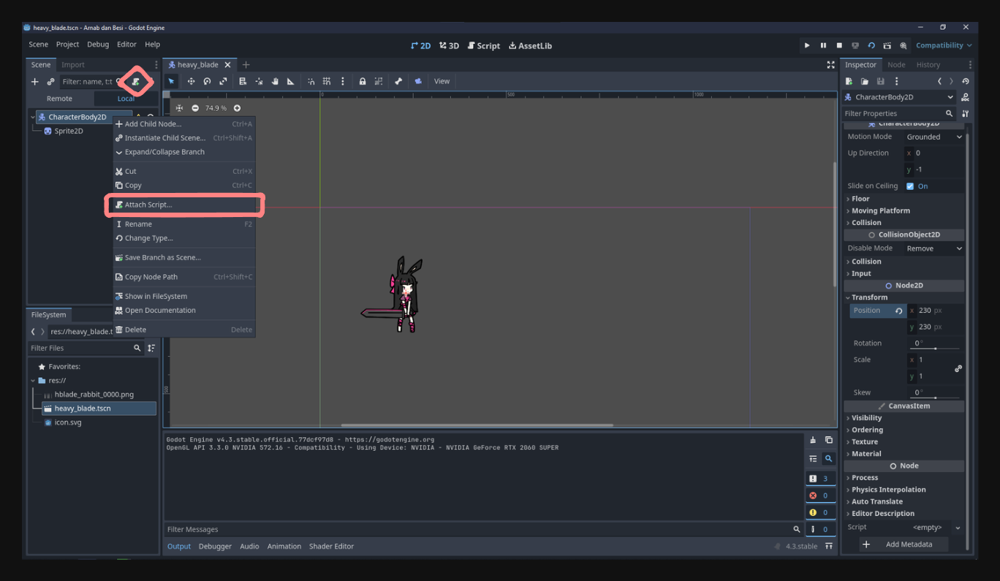

Kamu akan diminta pilih bahasa script dan beri nama script-nya. Dalam project ini, kita pakai **GDScript**.
   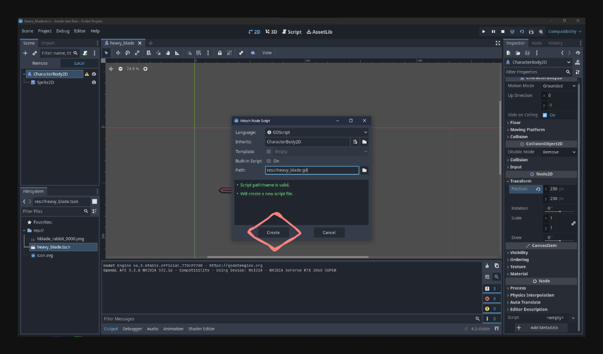

Misalnya, beri nama script **"heavy_blade.gd"** agar sesuai dengan nama scene. Lalu, kamu akan melihat tab script (menggantikan tab scene) yang isinya:
   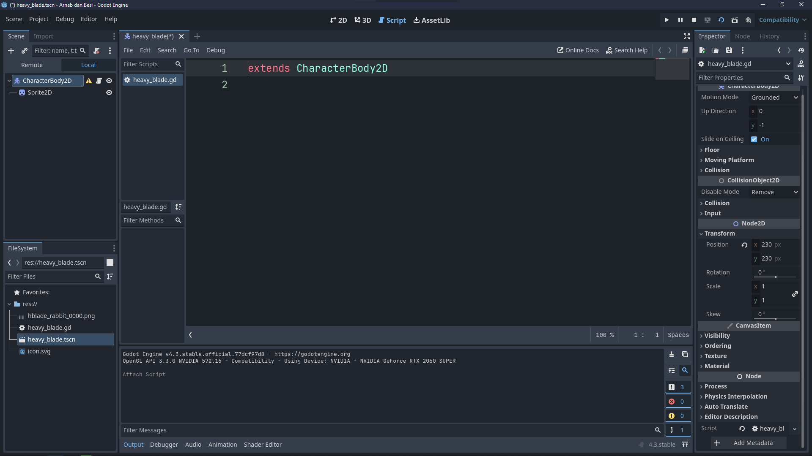
```gdscript
extends CharacterBody2D
```
Ini artinya script sudah terlampir pada node `CharacterBody2D`.

### Writing Code in Your Script

Bisa langsung nulis kode di bawah baris `extends`? Bisa, tapi kalau kamu nulis kode langsung tanpa dibungkus dalam fungsi, akan muncul error "unexpected identifier". Semua kode yang bisa dijalankan harus ada dalam fungsi. **GDScript** nggak punya fungsi `main()`, melainkan bergantung pada fungsi virtual.
   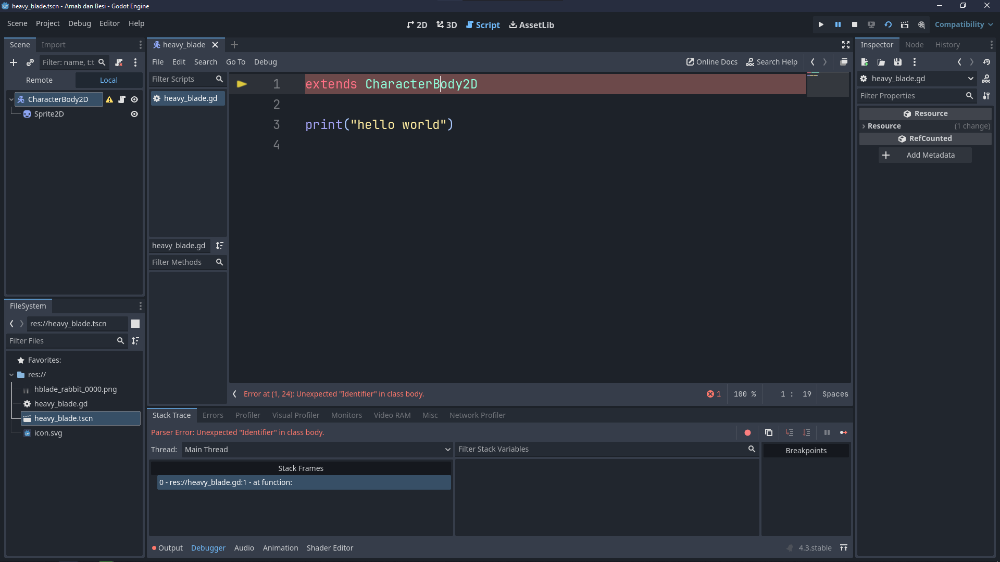

#### The `_ready()` Function

Fungsi `_ready()` dipanggil saat node ditambahkan ke scene. Coba tambahkan perintah print:
```gdscript
func _ready():
    print("Hello, World!")
```
Jalankan scene, dan kamu akan lihat "Hello, World!" di console, bukti bahwa `_ready()` berjalan.
   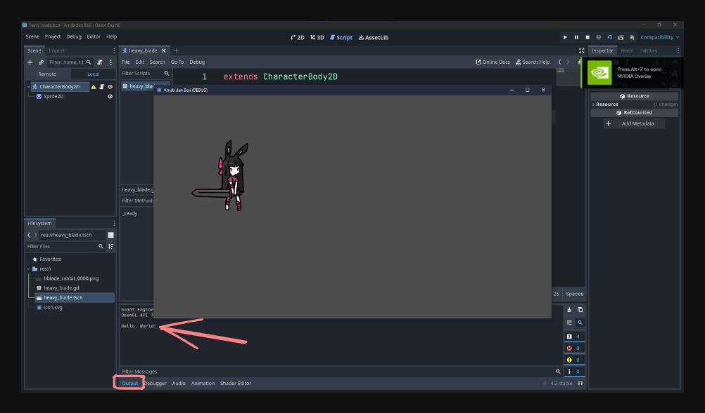

#### The _process() Function

Fungsi `_process()` dipanggil setiap frame, cocok buat tugas seperti menggerakkan karakter:
```gdscript
func _process(delta: float) -> void:
  print("Hello, World!")
```
Jalankan scene, dan kamu akan lihat "Hello, World!" terprint tiap frame, menandakan bahwa `_process()` berjalan terus.
   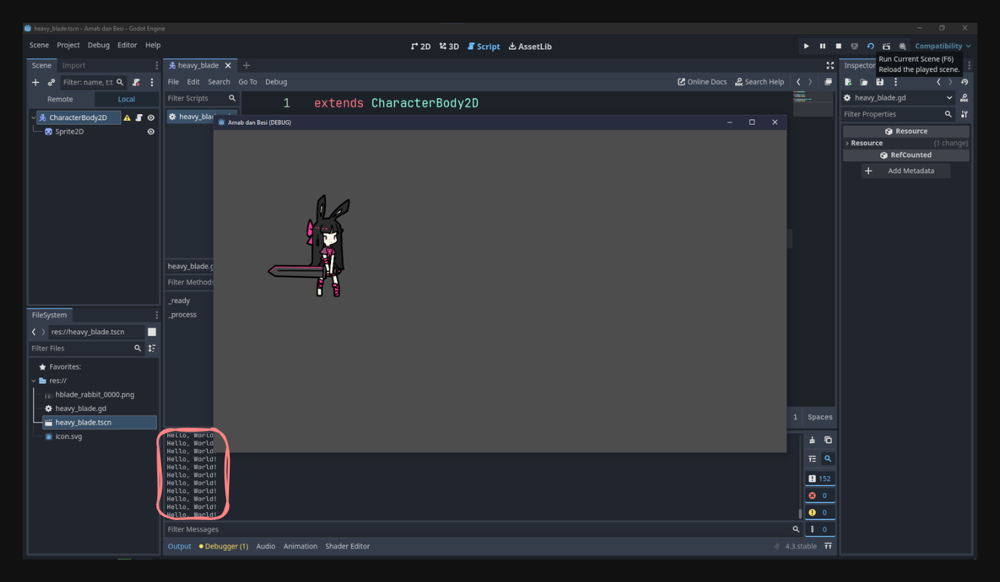

#### The `_unhandled_input()` Function

Fungsi `_unhandled_input()` dipanggil setiap kali ada input dari pemain. Misalnya, untuk mendeteksi penekanan tombol:
```gdscript
func _unhandled_input(event: InputEvent) -> void:
    print("Something is pressed")
```
Saat scene dijalankan, "Something is pressed" akan muncul di console tiap kali ada input.
   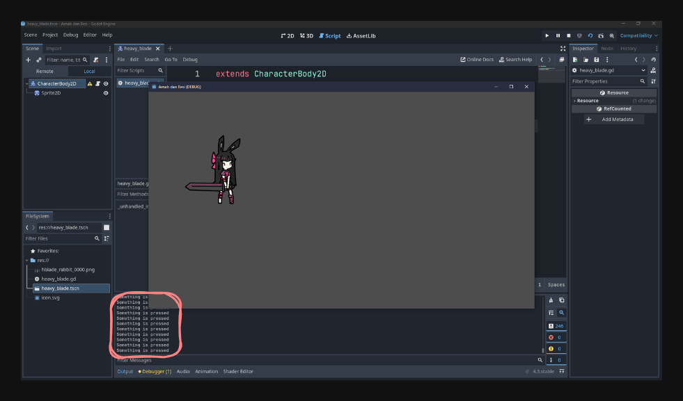

### Moving the Character

Sekarang, mari kita gerakkan karaktermu.

#### Understanding Movement

Setiap node di Godot punya properti **position** yang merupakan **Vector2**—sepasang koordinat (x, y). Ini cara mengubah posisinya:
- **Ke kanan:** Tambahkan nilai pada koordinat **x**
- **Ke kiri:** Kurangi nilai pada koordinat **x**
- **Ke atas:** Kurangi nilai pada koordinat **y** (ingat, sumbu **y** di Godot terbalik)
- **Ke bawah:** Tambahkan nilai pada koordinat **y**

   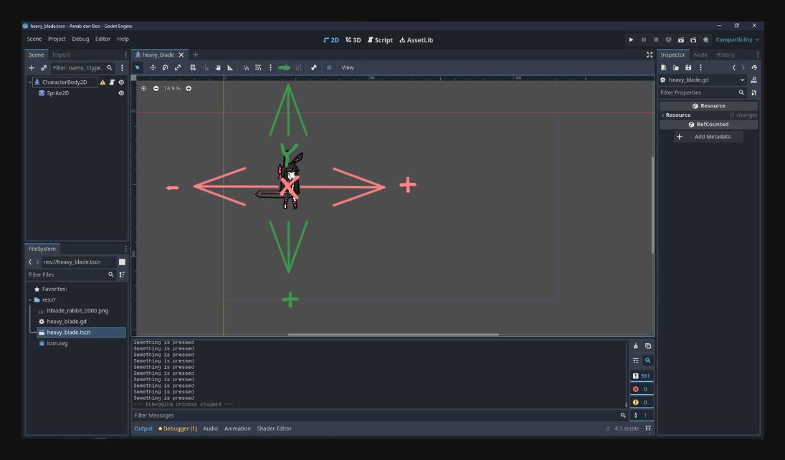

#### Moving with `_process()`

Pertama, coba gerakkan karaktermu otomatis dengan mengubah posisinya di dalam fungsi `_process()`:
```gdscript
func _process(delta: float) -> void:
    position += Vector2(5, 0)
```
Jalankan scene, dan karaktermu akan bergerak ke kanan karena tiap frame nilai 5 ditambahkan ke koordinat **x**.

Untuk menggerakkan ke bawah, ubah koordinat **y**:
```gdscript
func _process(delta: float) -> void:
    position += Vector2(0, 5) * delta
```
Ini akan membuat karaktermu bergerak ke bawah.

Coba eksperimen dengan pergerakan ini supaya kamu makin paham cara kerjanya.

#### Moving with Arrow Keys

Untuk menggerakkan karaktermu pakai tombol panah, pertama-tama atur tombolnya di **Input Map** pada pengaturan project:
1. Tambahkan aksi baru bernama `move_right` dan tetapkan tombol panah kanan.
2. Lakukan hal yang sama untuk `move_left`, `move_up`, dan `move_down`.

   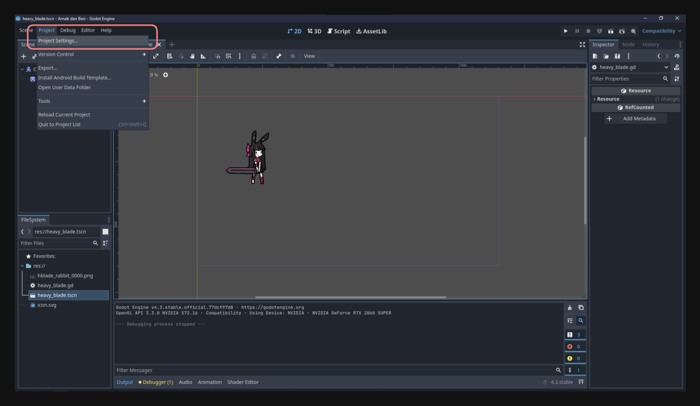  
   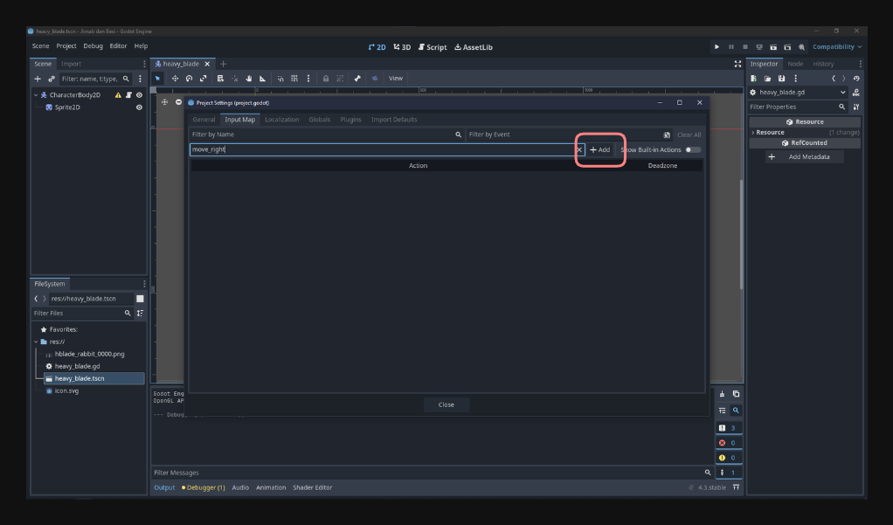  
   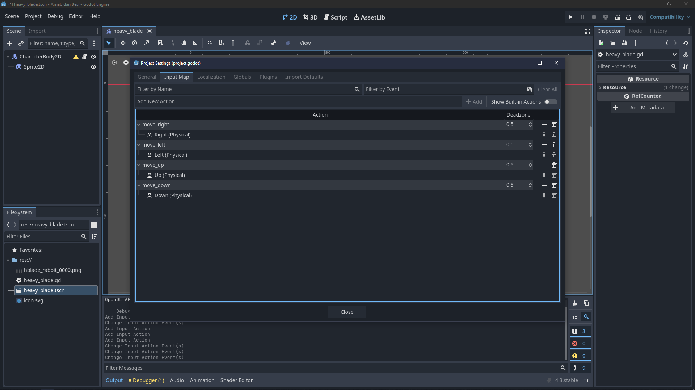

Kemudian, implementasikan penanganan input:
```gdscript
func _unhandled_input(event: InputEvent) -> void:
    if event.is_action_pressed("move_right"):
        position += Vector2(5, 0)
```
Jalankan scene, dan karaktermu akan bergerak ke kanan saat tombol panah kanan ditekan.

Lengkapi kode untuk menangani semua arah:
```gdscript
func _unhandled_input(event: InputEvent) -> void:
    if event.is_action_pressed("move_right"):
        position += Vector2(5, 0)
    if event.is_action_pressed("move_left"):
        position += Vector2(-5, 0)
    if event.is_action_pressed("move_up"):
        position += Vector2(0, -5)
    if event.is_action_pressed("move_down"):
        position += Vector2(0, 5)
```
Saat scene dijalankan, karaktermu akan bergerak sesuai tombol panah yang ditekan.
<video src="move_jitter.mp4" controls></video>

Namun, kamu mungkin akan melihat pergerakannya agak tersendat. Ini karena gerakan hanya diterapkan saat input terdeteksi, padahal seharusnya gerakan itu kontinu.

Fungsi `_unhandled_input()` ternyata kurang pas untuk input yang terus menerus.  
Mari kita refactor kodenya ke dalam fungsi `_process()`:
```gdscript
func _process(delta: float) -> void:
    if Input.is_action_pressed("move_right"):
        position += Vector2(5, 0)
    if Input.is_action_pressed("move_left"):
        position += Vector2(-5, 0)
    if Input.is_action_pressed("move_up"):
        position += Vector2(0, -5)
    if Input.is_action_pressed("move_down"):
        position += Vector2(0, 5)
```
<video src="move_smooth.mp4" controls></video>

## Conclusion

Selamat, kamu telah menyelesaikan pelajaran pertama! Hari ini, kamu telah belajar cara download dan setup Godot, membuat project pertama, mengenal editor, serta membuat scene dasar menggunakan nodes dan script. Ini adalah langkah awal penting dalam perjalanan pembuatan game kamu.

Ingat, di tahap awal kita bahas secara detail supaya kamu lebih nyaman dengan konsep-konsep baru. Nanti, saat kamu makin paham, panduannya akan jadi lebih ringkas sehingga kamu punya ruang untuk bereksperimen sendiri. Pelajaran ini sengaja dibuat singkat agar tidak membuat kamu kewalahan dengan informasi.

Luangkan waktu untuk berlatih dengan apa yang sudah kamu pelajari. Coba buat scene dan script sendiri serta eksplorasi kode-kodenya. Mungkin kamu juga akan nemu bagian-bagian kode yang sengaja dibuat ambiguous, contohnya:
Apa itu **delta**? Apa maksud `-> void`? Bagaimana cara kerja **Vector2**?  
Apakah ini cara terbaik buat menggerakkan karakter?  
Bagaimana biar gerakannya lebih halus?

Kalau ada pertanyaan, jangan ragu untuk tanya di Discord.

Kerja bagus sudah ambil langkah pertama—tetap semangat, dan selamat ngoding!

Sampai jumpa di pelajaran berikutnya!