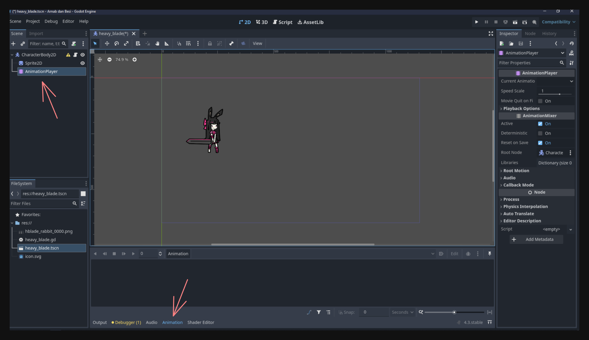
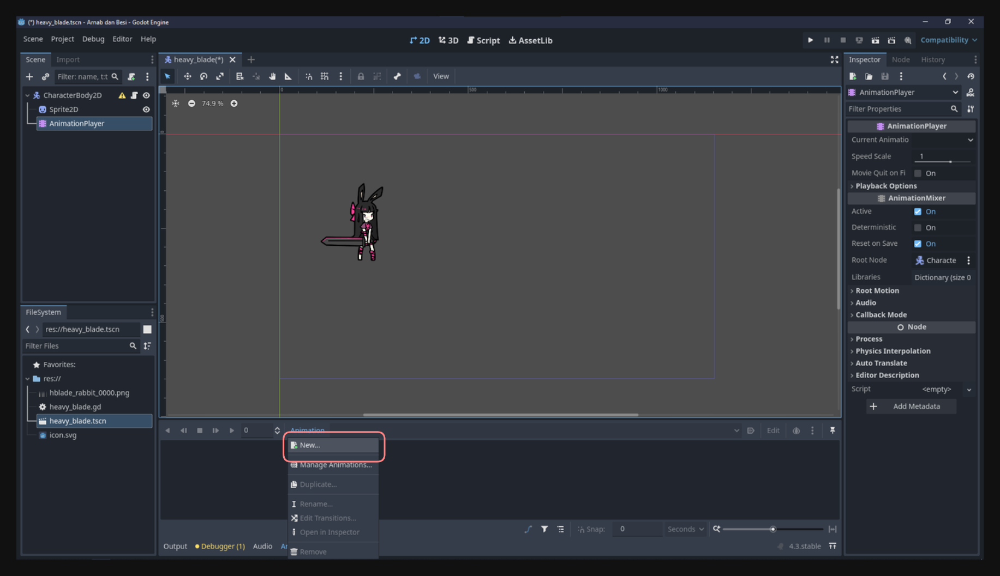
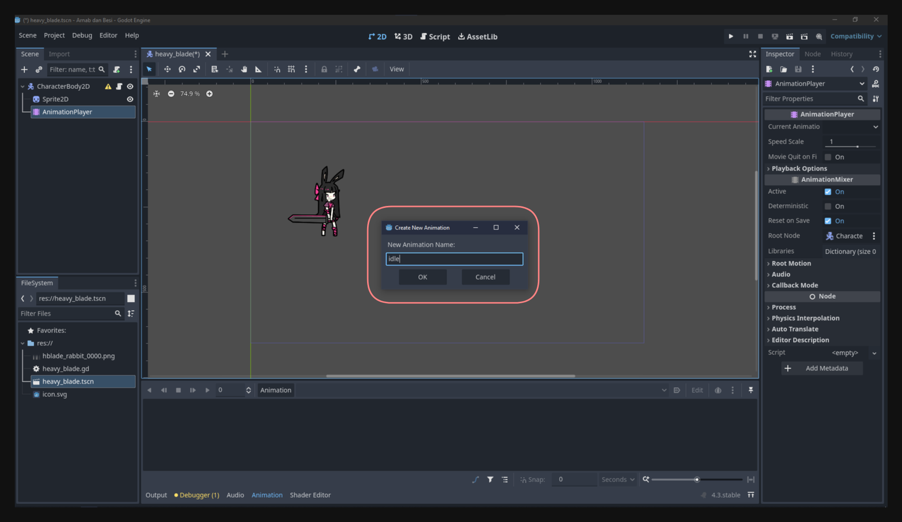
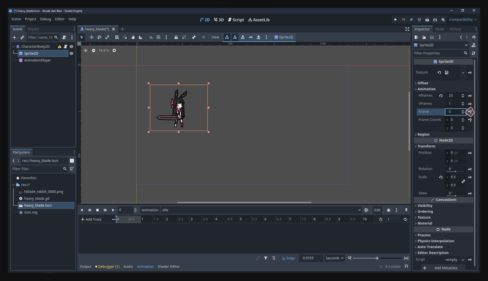
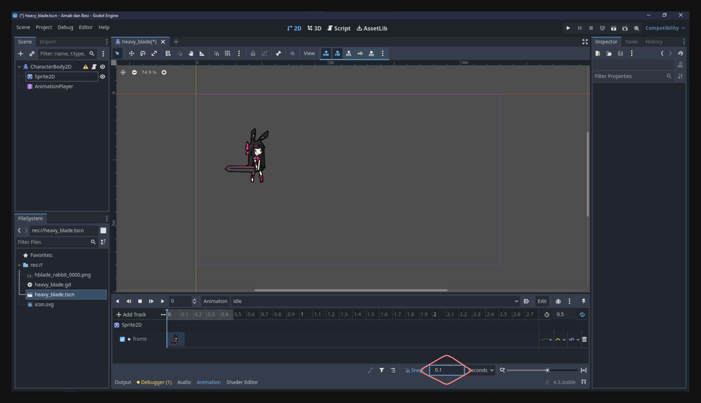
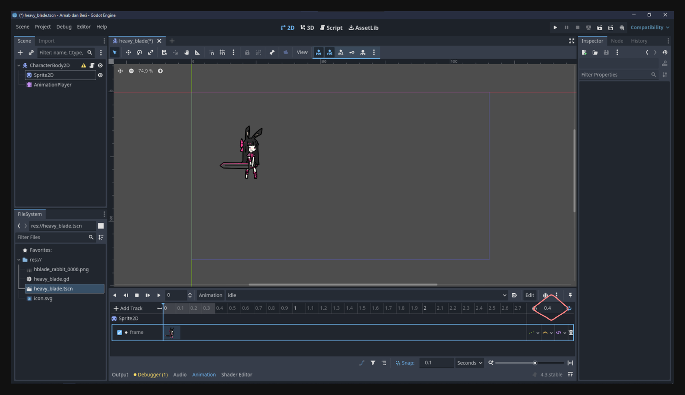
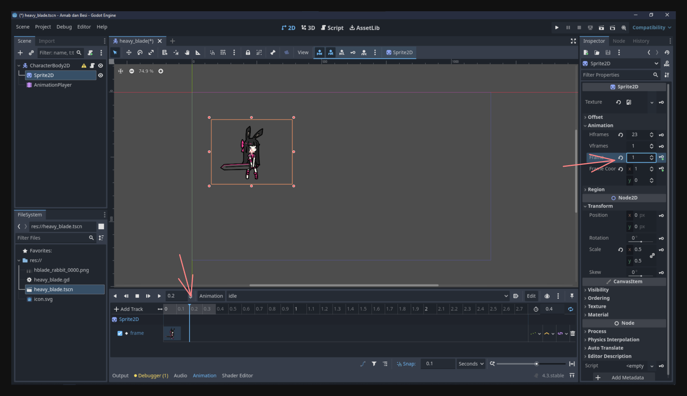

## Introduction  
Animasi itu bagian penting dalam bikin game—soalnya, ya, game itu kan tentang bikin gambar bergerak, entah karena input pemain atau logika game. Di pelajaran ini, kita bakal bahas cara bikin dan ngontrol animasi di Godot pakai **AnimationPlayer** node dan scripting. Dah ini, kamu bakal paham gimana caranya bikin animasi karakter pas diam dan bergerak, serta ngontrolnya pakai kode.  

---

## Animation Player  

**AnimationPlayer** node di Godot ini kayak pusat kontrol buat animasi. Bisa bikin, edit, dan ngontrol animasi buat properti node apa pun seiring waktu (misalnya posisi, rotasi, skala, sprite frame index, dll.). Di sini kita bakal mulai dari yang simpel: bikin animasi **idle** dan **movement**, terus belajar cara manggilnya pakai kode.  

### Ngontrol Properti Node Pakai Animation Player  

Kita mulai dari **AnimationPlayer** dulu, belum masuk kode biar paham cara kerja keyframe dan animation track.  

#### 1. Tambahin Animation Player ke Scene Karakter  
1. Di Scene panel (biasanya di kiri editor Godot), cari **AnimationPlayer** terus tambahin sebagai child dari scene karakter.  
2. Pilih **AnimationPlayer**, terus cek panel bawah editor, bakal muncul tab baru **Animation**. Ini tempat buat kelola dan preview animasi.  
  

#### 2. Bikin Animasi Baru  
1. Di panel animasi, klik **New Animation**.  
  
2. Kasih nama **idle**, ini buat karakter pas diem.  
  

Sekarang Godot bikin timeline kosong buat animasi baru ini. Kita bisa mulai masukin track/keyframe buat atur perubahan properti seiring waktu.  

#### 3. Masukin Properti Node ke Animation Track  
1. Pastikan **AnimationPlayer** masih dipilih dan animasi **idle** lagi dibuka di panel animasi.  
2. Pilih node yang mau dianimasikan—misalnya **Sprite2D** yang nunjukin frame karakter.  
3. Di Inspector, cari properti yang mau dianimasikan (misalnya frame property).  
4. Cek dulu frame mana yang mau dipake.  
<video src="checking_frame.mp4" controls></video>  

5. Klik ikon **key** di samping properti buat masukin keyframe di posisi timeline saat ini, terus klik **Create** pas muncul prompt.  
  

6. Karena ini pixel art, atur snapping ke nilai kecil supaya gampang dikontrol. Aku pake 0.1.  
  

7. Ubah durasi animasi, aku set ke 0.4 detik.  
  

8. Seret timeline, masukin keyframe kedua di 0.2 detik.  
  

Makin deket keyframe-nya, makin cepet animasinya.  

#### 4. Ngetes Animasi  
1. Klik tombol **Play** di panel animasi.  
2. Lihat sprite-nya ganti frame sesuai keyframe yang udah diatur.  
3. Kalau kurang pas, atur lagi keyframe-nya sampai dapet efek yang diinginkan.  

#### 5. Biar Animasi Loop  
Animasi **idle** ini kan harus jalan terus, jadi:  
1. Di panel animasi, klik tombol **Loop** (biasanya ikon panah melingkar).  
2. Pastikan opsi “Loop” nyala di properti animasi.  

#### 6. Bikin Animasi Nyala Pas Scene Dimulai  
Biar **idle** otomatis dimainkan pas scene dimulai:  
1. Klik tombol **Default** di panel animasi.  
2. Sekarang animasi **idle** bakal langsung jalan.  
<video src="set_loop.mp4" controls></video>  

Jalankan scene dan lihat animasi **idle** jalan otomatis.  

---

### Bikin Animasi Gerakan  
Sekarang, kita bikin dua animasi baru: **move_left** dan **move_right**. Animasi ini bakal diplay pas karakter gerak ke kiri atau kanan.  

#### 1. Bikin Animasi Baru  
Ulangi langkah tadi:  
1. Di panel animasi, buat animasi baru dengan nama **move_left**.  
2. Buat lagi animasi baru dengan nama **move_right**.  

Sekarang kita punya **idle**, **move_left**, dan **move_right** di **AnimationPlayer**.  

Aku percaya kamu bisa ngerjain langkah-langkah selanjutnya sendiri.  

---

## Ngontrol Animasi Pakai Kode  
Kalau ngontrol animasi cuma pakai AnimationPlayer sih oke buat animasi static, tapi di game kita butuh sesuatu yang lebih dinamis. Nah, ini saatnya pakai GDScript.  

### Cara Deteksi Arah Gerakan  
Kita pengen animasi **move_left** main kalau karakter jalan ke kiri, **move_right** buat kanan, dan **idle** kalau diam.  

Ada dua cara buat deteksi gerakan:  
1. **Cek Input**: Kalau `Input.is_action_pressed("move_left")`, animasi **move_left** dimainkan.  
2. **Cek Velocity**: Cek nilai `velocity.x` karakter, kalau negatif berarti ke kiri, positif ke kanan.  

Aku lebih suka pake velocity karena lebih akurat, soalnya ini ngitung semua pengaruh termasuk fisiknya.  

---

### Ngupdate Logika Gerakan  
Di Godot 4, **CharacterBody2D** punya built-in method buat gerakan, kayak `move_and_slide()`. Biasanya kita bakal itung velocity dari input pemain terus diterapkan tiap frame.  

Kode karakter yang diperbarui:  

```gdscript
extends CharacterBody2D

func _process(delta: float) -> void:
    var direction = Vector2.ZERO
    
    if Input.is_action_pressed("move_left"):
        direction.x = -5
    if Input.is_action_pressed("move_right"):
        direction.x = 5
    if Input.is_action_pressed("move_up"):
        direction.y = -5
    if Input.is_action_pressed("move_down"):
        direction.y = 5
        
    velocity = direction
    
    move_and_slide()
```  

Kalau geraknya lambat, ubah angka 5 jadi angka lebih besar, misalnya 200.  

---

### Dapetin Referensi ke Animation Player di Kode  
Buat ngubah animasi lewat kode, kita harus dapetin referensi ke **AnimationPlayer**:  

```gdscript
var animation_player = get_node("AnimationPlayer")
```  

---

### Gabungin Logika Gerakan + Animasi  

**Kode Lengkap**:  

```gdscript
extends CharacterBody2D

var animation_player

func _ready():
    # Assign the AnimationPlayer node to the animation_player variable when the scene is ready
    animation_player = get_node("AnimationPlayer")

func _process(delta: float) -> void:
    var direction = Vector2.ZERO
    
    if Input.is_action_pressed("move_left"):
        direction.x = -200
    if Input.is_action_pressed("move_right"):
        direction.x = 200
    
    velocity = direction
    move_and_slide()
    
    if velocity.x > 0:
        animation_player.play("move_right")
    elif velocity.x < 0:
        animation_player.play("move_left")
    else:
        animation_player.play("idle")
```  

Jalankan scene dan lihat animasi berubah sesuai pergerakan karakter.  
<video src="movement.mp4" controls></video>  

---

## Conclusion  
Sekarang kamu udah ngerti cara pake **AnimationPlayer** dan ngontrol animasi pakai GDScript! Bisa bikin animasi sendiri, looping animasi, dan ganti animasi berdasarkan gerakan karakter.  

Selanjutnya kamu bisa eksplorasi fitur animasi yang lebih kompleks kayak animation blending atau state machine. Kalau ada yang bingung, tanya aja di Discord!  

Sampai ketemu di pelajaran berikutnya! 🚀