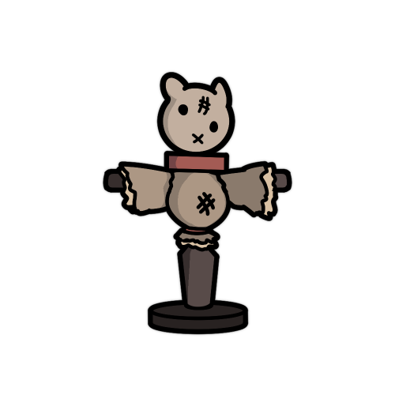
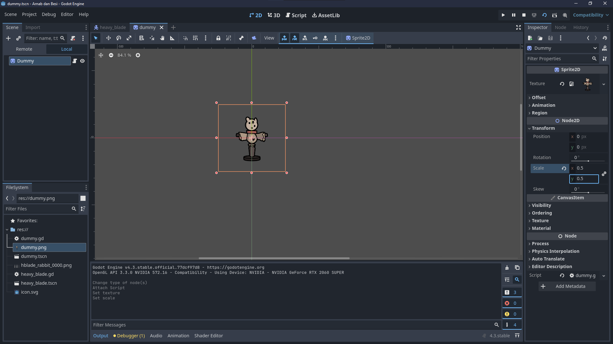
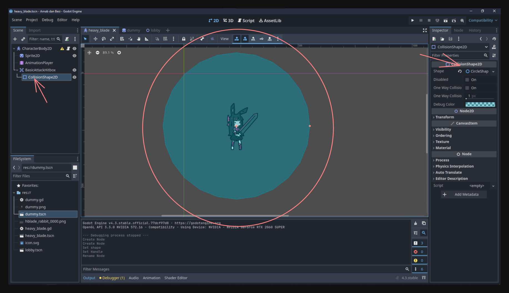
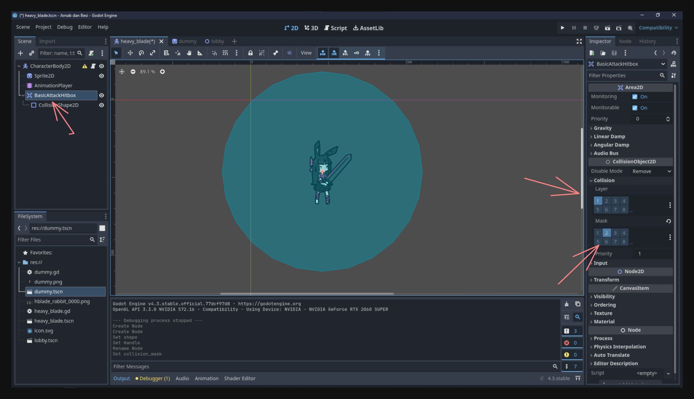
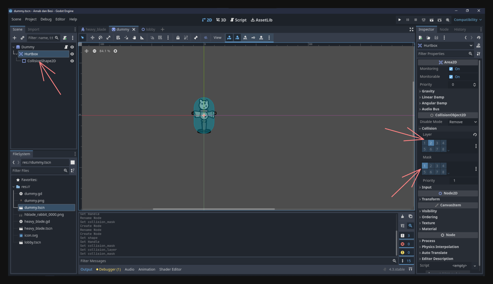
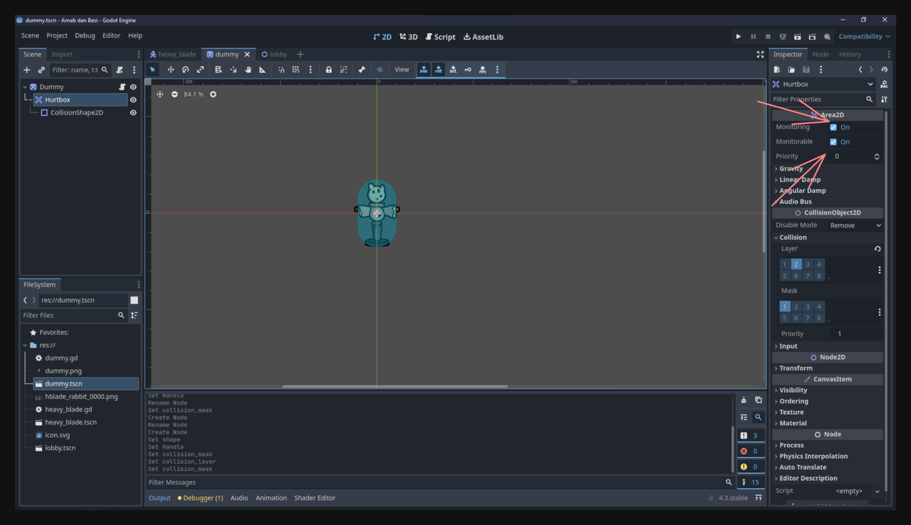
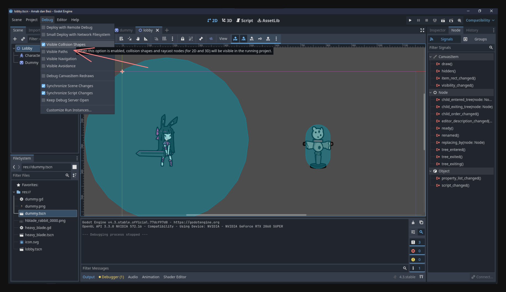
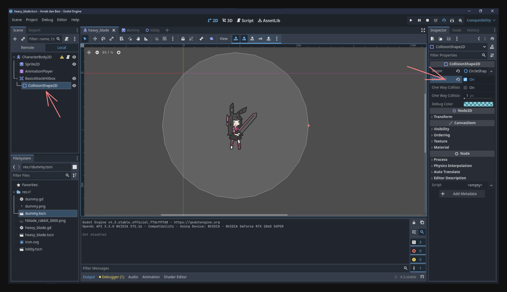

Di pelajaran ini, kita bakal nambahin animasi serangan dasar ke pemain dan mendeteksi collision antara serangan pemain (basic attack) dan enemy. Proses ini melibatkan setup **attack input**, bikin **hitboxes** (di pemain) dan **hurtboxes** (di enemy), dan ngontrol kapan hitbox itu aktif biar enemy cuma kena damage pas frame serangan beneran aja.

---

## Adding an Attack Animation  

Pertama, kita butuh animasi yang nunjukin karakter kita pas lagi nyerang.

1. **Create the Animation**  
   Buka `heavy_blade.tscn` (scene pemain), pilih **AnimationPlayer**, dan bikin animasi baru bernama `basic_attack`. Tambahin frames (atau keyframes) yang nampilin gerakan ayunan senjata karaktermu. Dengan begitu, kita punya rangkaian animasi khusus buat serangan, terpisah dari idle dan run.

2. **Adjust Timing and Frames**  
   Setelah nambahin frames, atur durasinya biar gerakannya terasa responsif. Kalau kepanjangan, karaktermu bisa kerasa lamban; kalau kependekan, animasinya nyaris ga kelihatan. Silakan coba-coba speed yang berbeda sampai kelihatan pas.  

Sampai tahap ini, kamu udah punya animasi yang kelihatan oke di editor, tapi belum dipicu sama input di dalam game.

Ini contoh basic attack animation punyaku (kalau mau, kamu bisa aja tiru):
<video src="attack_animation.mp4" controls></video>

---

## Adding Attack Input  

Sekarang, kita bikin biar pas pemain mencet tombol tertentu, animasi `basic_attack` langsung main.

1. **Create a New Input Action**  
   Masuk ke **Project > Project Settings > Input Map**, terus tambahin action baru namanya `basic_attack`, dan pasang di tombol `Z`. Dengan gini, logika serangan terpisah dari tombol spesifik, jadi kalau mau diganti, tinggal atur di sini.

2. **Detect Input in Your Script**  
   Di `heavy_blade.gd`, tambahin atau modif `_unhandled_input(event)` buat ngecek action `basic_attack`. Kalau ditekan, langsung mainin animasi `basic_attack`:

   ```gdscript
   func _unhandled_input(event):
       if event.is_action_pressed("basic_attack"):
           animation_player.play("basic_attack")
   ```

3. **Avoid Overwriting the Attack Animation**  
   Mungkin kamu udah punya kode yang ngatur frame Sprite2D pas pemain gerak, jadi pastiin ga menimpa animasi `basic_attack` pas gerak. Tambahin cek sederhana di `_process(delta)` atau fungsi gerakan, supaya animasi gerak ga jalan kalau `basic_attack` lagi main:

   ```gdscript
   ...

   if animation_player.current_animation != "basic_attack":
       if velocity.x > 0:
           animation_player.play("move_right")
       elif velocity.x < 0:
           animation_player.play("move_left")
       elif velocity.y != 0:
           animation_player.play("move_right") 
       else:
           animation_player.play("idle")

   ...
   ```

Sekarang, pencet `Z` bakal mancing animasi serangan. Tapi sejauh ini, belum berdampak apa-apa di game.
<video src="nothing.mp4" controls></video>

---

## Creating a Dummy Enemy  

Kita bikin enemy dummy buat ngetes efek serangan pemain.

1. **New Scene for the Enemy**  
   Bikin scene baru namanya `dummy.tscn`, dan pake **Sprite2D** sebagai root node. Pasang tekstur apa aja sebagai placeholder enemy, atau pakai yang aku kasih:  
   

2. **Basic Setup**  
   Enemy ini ga bakal gerak atau nyerang balik dulu—cuma ada buat ngetes hit. Tambahin script simpel (`dummy.gd`) kalo mau siapin logic HP atau lainnya. Sesuaikan scale kalau kegedean atau kekecilan.
   

---

## Making a Lobby Scene  

Kita perlu satu scene yang isinya player dan dummy enemy bareng biar bisa saling interaksi.

1. **Create `lobby.tscn`**  
   Bikin `lobby.tscn`, tambahin **Node2D** sebagai root. Ini bakal jadi “ruangan” atau “level” tempat kamu naro objek.

2. **Instance Player and Enemy**  
   Tarik `heavy_blade.tscn` (player) dan `dummy.tscn` (enemy) ke dalam `lobby.tscn`. Atur posisinya sesukamu.  
   <video src="instance.mp4" controls></video>

3. **Test It Out**  
   Coba jalanin `lobby.tscn`, gerakin pemain, dan tekan `Z` buat nyerang. Kamu bakal lihat animasinya, tapi enemy belum bereaksi karena kita belum setup collision atau sistem damage.
   <video src="nothing.mp4" controls></video>

---

## Making the Enemy Take Damage  

Kalau ngomongin serangan, umumnya ada dua sisi:

- **Hitbox**: Area di karakter penyerang yang menghasilkan damage.  
- **Hurtbox**: Area di karakter yang diserang, tempat damage bisa diterima.

---

## Adding a Hitbox  

### Player Hitbox  

1. **Add an Area2D**  
   Di `heavy_blade.tscn`, tambahin child node ke root node pemain. Kasih nama `BasicAttackHitbox` dan set ke **Area2D**. Node ini yang bakal deteksi overlap sama enemy.

2. **Add a CollisionShape2D**  
   Sebagai child dari `BasicAttackHitbox`, tambahin **CollisionShape2D**. Atur ukuran dan bentuknya biar kurang lebih sesuai area serangan.  
   

3. **Assign Collision Layers**  
   Di Inspector `BasicAttackHitbox`, set **Collision Layer** ke `1` dan **Collision Mask** ke `2`. Ini berarti dia ada di layer 1 dan bakal mendeteksi objek di layer 2.  
   

### Enemy Hurtbox  

1. **Add an Area2D**  
   Di `dummy.tscn`, tambahin child node namanya `Hurtbox` (juga **Area2D**). Ini nentuin area dimana enemy bisa kena serangan.

2. **Add a CollisionShape2D**  
   Di dalam `Hurtbox`, tambahin **CollisionShape2D** yang nutupin sprite enemy.

3. **Assign Collision Layers**  
   Di Inspector, set **Collision Layer** ke `2` dan **Collision Mask** ke `1`. Artinya, hurtbox enemy ada di layer 2 dan ngecek objek di layer 1—pas buat hitbox player.  
   

Dengan atur layer dan mask kayak gini, hitbox player cuma berinteraksi sama hurtbox enemy, ga bentrok sama layer lain.

---

## Connecting Signals and Dealing Damage  

Hitbox dan hurtbox udah ada, sekarang kita bikin enemy bereaksi pas keduanya overlap.

1. **Enable Monitoring**  
   Di `BasicAttackHitbox` dan `Hurtbox`, centang **Monitoring** dan **Monitorable** biar bisa mendeteksi overlap.  
   

2. **Connect `area_entered` on the Enemy**  
   Pilih `Hurtbox` di `dummy.tscn`, buka tab Node > **Signals**, sambungin `area_entered` ke `dummy.gd`. Fungsi bakal keliatan kayak gini:  
   <video src="connect_signal.mp4" controls></video>

   ```gdscript
   func _on_hurtbox_area_entered(area: Area2D):
       if area.name == "BasicAttackHitbox":
           queue_free()
   ```

   Buat ngetes, kita langsung pake `queue_free()` biar enemy hilang. Tapi ini bakal kepicu meski hitbox aktif pas idle. Kita bakal benerin ini abis ini.  
   <video src="enemy_die.mp4" controls></video>

   > Buat debugging, kamu bisa show collision di debug menu.
   

---

## Activating the Hitbox Only During Attack  

1. **Disable Hitbox by Default**  
   Di Inspector `CollisionShape2D` dalam `BasicAttackHitbox`, centang **Disabled**. Jadi default-nya hitbox mati sampe kita aktifin.  
   

2. **Toggle via Animation**  
   Balik ke `heavy_blade.tscn`, buka **AnimationPlayer**. Di animasi `basic_attack`, tambahin **Property Track** buat properti `disabled` di `BasicAttackHitbox` `CollisionShape2D`. Di frame dimana serangan “kena”, set ke `false` (aktif), terus di akhir ayunan, set balik ke `true` (nonaktif).  
   <video src="animation_disable.mp4" controls></video>

Sekarang, enemy cuma kena damage di frame serangan yang bener-bener aktif.  
<video src="attack_die.mp4" controls></video>

---

## Adding Health Logic to the Enemy  

Kalau ga mau enemy langsung hilang sekali pukul, bisa tambahin HP:

```gdscript
var hp = 3

func _on_hurtbox_area_entered(area: Area2D):
    if area.name == "BasicAttackHitbox":
        hp -= 1
        if hp <= 0:
            queue_free()
```

Dengan begitu, enemy butuh beberapa kali pukulan sebelum kalah.  
<video src="attack_combo.mp4" controls></video>

---

## Conclusion  

Dengan langkah-langkah di atas, kamu udah:

- Bikin animasi **basic attack** dan mengaitkannya ke **input action**.  
- Ngejaga biar animasi gerak ga tumpang tindih sama animasi serangan.  
- Nambah **Area2D** buat bikin sistem **hitbox/hurtbox** sederhana.  
- Manfaatin **collision layers dan masks** biar cuma serangan player yang bentrok sama hurtbox enemy.  
- Aktifin hitbox cuma di frame serangan lewat timeline animasi.  
- Nambahin opsi **health** buat enemy (atau ga sama sekali) dan lenyap kalau habis.

Dengan pondasi ini, kamu bisa ngembangin combat system lebih jauh: nambah tipe serangan lain, variasi damage, knockback buat enemy, atau AI yang lebih cerdas. Sekarang game-mu udah punya combat loop dasar—tekan `Z` buat nyerang dan lihat dummy enemy bereaksi (atau mati). 

Sampai ketemu di pelajaran berikutnya! 🚀