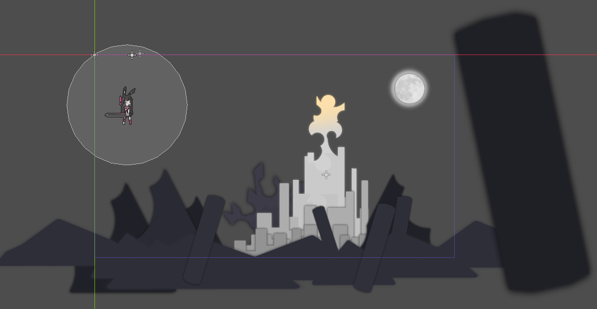
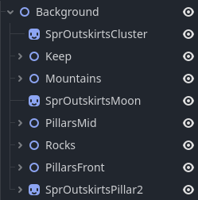

## Introduction
Di tahap ini, kita udah punya karakter, musuh dummy, dan level dasar. Meskipun semuanya jalan, suasananya masih kerasa kayak tech demo—belum berasa imersif seperti game utuh. Supaya game kita lebih “hidup,” kita perlu menambah elemen visual, sehingga “lobby” ini benar-benar bisa menyambut pemain. Ini juga membantu memvisualisasikan wujud akhir game kita.

---

## Window Settings and Game View
Waktu pertama kali jalanin project di Godot, mungkin pas kita resize window gamenya, tampilannya jadi aneh atau melar. Tujuan kita di sini adalah memastikan game bisa menyesuaikan resolusi dengan lebih baik.

Kalau saat ini kamu resize window gamenya, hasilnya mungkin akan seperti ini:

<video src="window_reize.mp4" controls></video>

### Canvas vs. Viewport
Di **Project Settings** → **Display → Window**, kita bisa atur bagaimana konten di-scaling:
- **Viewport**: Scene dirender di resolusi tetap, lalu di-scale ke ukuran window. Biasanya cocok untuk pixel art.
- **Canvas Item**: Mengatur area gambar agar pas dengan ukuran window secara dinamis. Cocok untuk game 2D yang non-pixel art.

Berikut perbandingan visualnya:

  

Kita akan pakai **Canvas Item** biar game kita menyesuaikan ukuran window secara otomatis. Begitu diaktifkan:

<video src="canvas_item_resize.mp4" controls></video>

Sekarang, scene bakal scale secara proporsional ketika kamu ubah ukuran window.

---

## Adjusting the Game Resolution
Masih di **Project Settings → Display → Window**, kita bisa set resolusi default ke **1920 × 1080** buat Full HD. Kalau terlalu besar, silakan sesuaikan dengan monitor masing-masing. Di sana juga ada opsi agar game langsung jalan dalam mode maximized atau fullscreen.

<video src="change_resolution.mp4" controls></video>

---

## Building the Lobby Scene
Setelah pengaturan window beres, kita bakal bikin “lobby” — semacam ruang awal yang menyambut pemain. 
Ini "referensi" kita:

<video src="analyze.mp4" controls></video>

## Observing the Reference
Kalau kamu lihat beberapa game side-scroller, biasanya ada layer terpisah: misalnya bulan, gedung, pegunungan, dan objek foreground. Layer-layer ini bisa digerakkan dengan kecepatan berbeda (parallax) buat ngasih efek jarak. Di contoh kita, kita mulai dengan layer statis, tapi tersusun rapi.
Berikut beberapa aset yang kita gunakan:

Ketika sudah kita gabung, hasil akhirnya akan seperti ini:

<video src="result.mp4" controls></video>

Supaya lebih ringan, kita bagi pembuatan level ini menjadi dua tahap: pertama bikin background, lalu di sesi berikutnya kita tambahin particle effects dan shader.

---

## Constructing the Background

### Importing Assets
Setelah semua gambar berada di **FileSystem** Godot, kamu bisa langsung drag ke panel **Scene** atau tambahkan `Sprite2D` dan assign gambarnya di **Texture**.

<video src="import_assets.mp4" controls></video>

### Grouping Elements
Sebelum atur posisi, buat `Node2D` bernama **Background** dan jadikan seluruh sprite child dari node ini. Cara ini mempermudah kalau kita mau mindahin semua background atau ngatur skalanya bareng-bareng.

<video src="grouping.mp4" controls></video>

### Arranging the Sprites
Setelah itu, posisikan sprite di 2D editor sehingga membentuk layer-layer latar belakang. Objek yang jauh (misalnya gunung) taruh di urutan belakang, sedangkan objek yang lebih dekat (seperti pilar atau batu) taruh di depan. Urutan node di panel **Scene** memengaruhi siapa yang tampil di atas atau di bawah.

### Adjusting Colors
Masing-masing `Sprite2D` punya property **Modulate** di **CanvasItem** untuk mengatur tint atau opacity. Kamu bisa meredupkan warna gunung biar kelihatan lebih jauh, atau kasih efek cahaya di sprite tertentu.

<video src="changing_color.mp4" controls></video>  

Buat gambaran, berikut contoh susunan node yang kupakai:

### Adding a Gradient Backdrop
Kalau hanya pakai solid color, kadang kurang menarik. Jadi, tambahkan `TextureRect` di dalam node **Background** dan buat ukurannya menutupi seluruh layar, lalu atur **Texture**-nya menjadi **Gradient**. Di Inspector, sesuaikan warna gradient, misalnya mulai dari ungu gelap di atas ke biru muda di bawah, memberi efek langit senja.

<video src="gradient_setting.mp4" controls></video>

Dengan ini, background di lobby sudah lebih hidup. Ada layer-layer dan warna yang saling mendukung, tanpa perlu tilemap rumit.

---

## Where We Stand
Setelah mengatur scale window, resolusi game, dan menyusun background berlapis, game kita jadi lebih imersif—nggak lagi sekadar tech demo. Lobby ini bakal jadi pintu pembuka sebelum pemain berpetualang di dalam game.

**Selanjutnya**, kita akan menambahkan:
- Particle Effects supaya ada efek gerakan visual
- Shader (godrays) agar cahaya di scene terasa lebih dramatis

Nantikan update selanjutnya! Sedikit sentuhan visual bakal bikin background yang tadinya statis terasa lebih hidup dan memesona.
