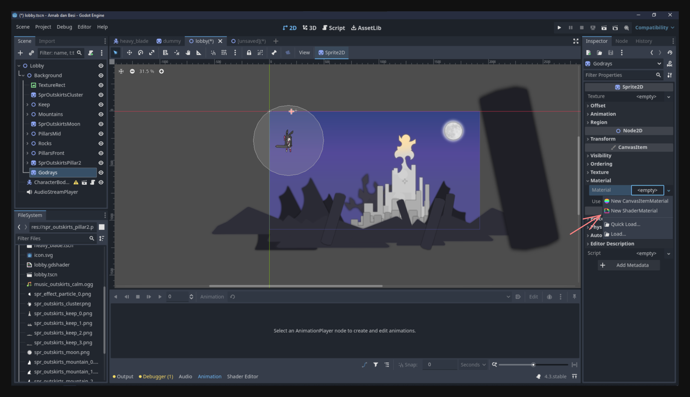
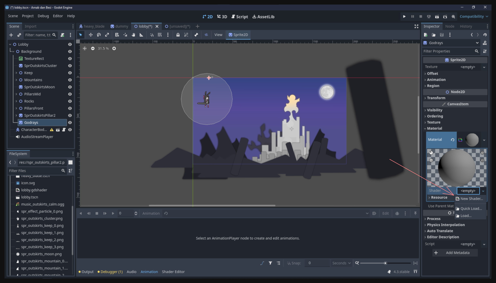
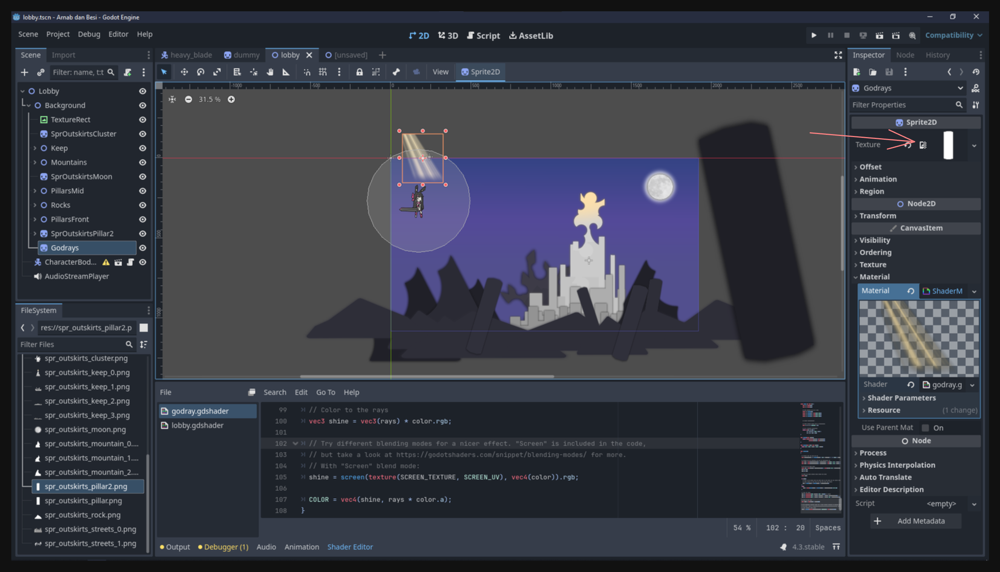
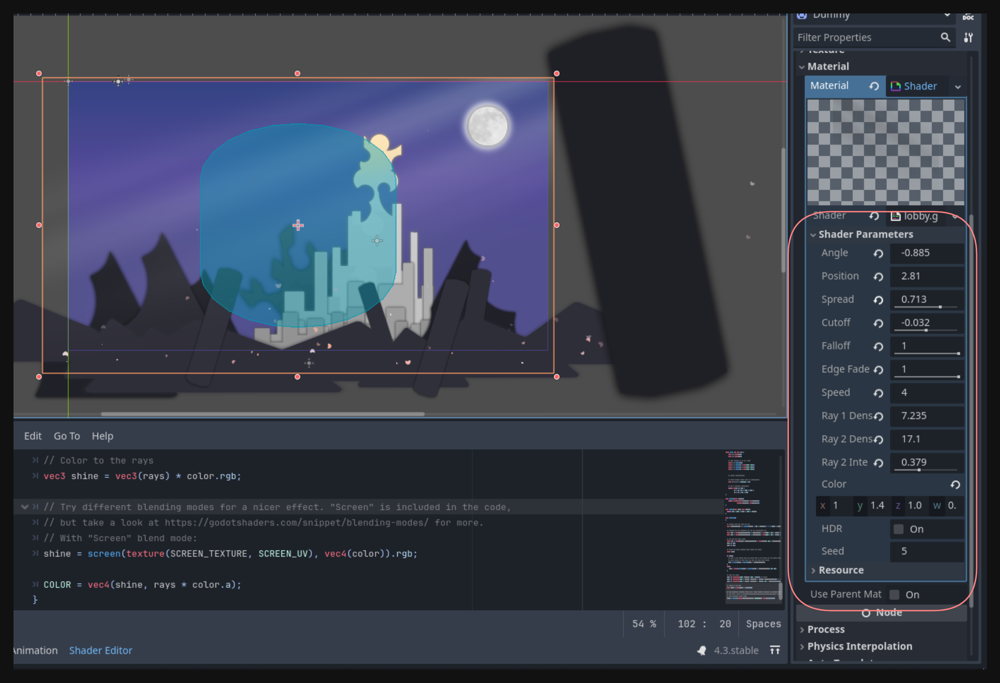

## Introduction

Di pelajaran sebelumnya, kita udah nambahin elemen background di level scene kita, tapi suasananya masih kerasa agak kaku. Salah satu alasannya adalah karena belum ada gerakan sama sekali. Kalo ga ada yang bergerak, scene bisa keliatan “statis” dan kurang hidup, walaupun artwork-nya detail.

Di pelajaran ini, kita bakal ngasih lebih banyak “nyawa” ke level scene dengan nambahin gerakan dan efek visual tambahan:

- **Godray effect** lewat shader, biar ada sinar cahaya lembut yang nambah suasana.
- **Particle effects** buat simulasi kelopak bunga yang melayang, ngasih kesan gerakan halus di udara.
- **Parallax movement** di beberapa elemen latar buat ngasih kesan kedalaman.

Hasil akhirnya, scene bisa keliatan kayak gini:

<video src="result.mp4" controls></video>

## Shaders

**Shader** adalah program kecil yang jalan di GPU, dipake buat ngatur gimana objek tampil di layar—mulai dari warna, tekstur, pencahayaan, dan sebagainya. Di Godot, shader ngebuka banyak kemungkinan efek visual di luar apa yang bisa dilakukan node biasa. Node itu memang fleksibel, tapi ga mungkin nyediain semua efek yang mungkin dibutuhin. Kalo kita butuh efek yang lebih spesifik, kita beralih ke shader.

### Why Godot Needs Shaders

Godot emang punya banyak node dan property buat bikin tampilan yang keren tanpa perlu nyentuh shader sama sekali. Tapi, beberapa efek—kayak pencahayaan khusus, distorsi, atau godrays—perlu kontrol lebih lanjut atas tiap piksel yang dirender. Daripada bikin node terpisah untuk setiap efek (yang bakal ribet dan sulit dirawat), Godot nyediain sistem shader ini. Dengan begitu, kita bisa bikin tampilan unik tanpa harus terbatas sama efek bawaan.

> **Note:** Nulis shader dari nol itu beda dari pemrograman prosedural biasa. Di pelajaran ini, kita gak akan ngupas detail teknis soal shader programming. Kita bakal pake shader yang udah jadi buat ngeliatin gimana integrasi shader ke scene. Pembahasan lebih dalam soal bahasa shader dan logikanya bakal ada di pelajaran selanjutnya.

### Adding a Godray Shader

1. **Bikin Sprite2D baru**:  
   Tambahin `Sprite2D` (atau node turunan `CanvasItem` lainnya) sebagai child dari background. Node ini yang bakal kita kasih material dengan godray shader.

2. **Set up ShaderMaterial**:  
   Di Inspector, cari property **Material** (biasanya ada di “CanvasItem Material”). Pilih **New ShaderMaterial** buat node ini. Ini bikin kita bisa assign shader kustom ke sprite.  
   

3. **Bikin Shader baru**:  
   Di dalam ShaderMaterial yang barusan, bikin **New Shader** dan kasih nama, misalnya `godray`.  
   

4. **Paste kode Shader**:  
   Klik shader yang baru dibuat buat buka shader editor. Lalu copy dan paste kode berikut (diambil dari [godotshaders.com](https://godotshaders.com/)). Shader ini mensimulasikan godrays:

   ```glsl
   /*
   Shader from Godot Shaders - the free shader library.
   godotshaders.com/shader/god-rays

   Feel free to use, improve and change this shader according to your needs
   and consider sharing the modified result on godotshaders.com.
   */

   shader_type canvas_item;

   uniform float angle = -0.3;
   uniform float position = -0.2;
   uniform float spread : hint_range(0.0, 1.0) = 0.5;
   uniform float cutoff : hint_range(-1.0, 1.0) = 0.1;
   uniform float falloff : hint_range(0.0, 1.0) = 0.2;
   uniform float edge_fade : hint_range(0.0, 1.0) = 0.15;

   uniform float speed = 1.0;
   uniform float ray1_density = 8.0;
   uniform float ray2_density = 30.0;
   uniform float ray2_intensity : hint_range(0.0, 1.0) = 0.3;

   uniform vec4 color = vec4(1.0, 0.9, 0.65, 0.8);

   uniform bool hdr = false;
   uniform float seed = 5.0;
   uniform sampler2D SCREEN_TEXTURE: hint_screen_texture, filter_linear_mipmap;

   float random(vec2 _uv) {
       return fract(sin(dot(_uv.xy,
                            vec2(12.9898, 78.233))) *
           43758.5453123);
   }

   float noise (in vec2 uv) {
       vec2 i = floor(uv);
       vec2 f = fract(uv);

       float a = random(i);
       float b = random(i + vec2(1.0, 0.0));
       float c = random(i + vec2(0.0, 1.0));
       float d = random(i + vec2(1.0, 1.0));

       vec2 u = f * f * (3.0 - 2.0 * f);

       return mix(a, b, u.x) +
              (c - a) * u.y * (1.0 - u.x) +
              (d - b) * u.x * u.y;
   }

   mat2 rotate(float _angle){
       return mat2(vec2(cos(_angle), -sin(_angle)),
                   vec2(sin(_angle), cos(_angle)));
   }

   vec4 screen(vec4 base, vec4 blend){
       return 1.0 - (1.0 - base) * (1.0 - blend);
   }

   void fragment()
   {
       vec2 transformed_uv = (rotate(angle) * (UV - position)) / ((UV.y + spread) - (UV.y * spread));

       vec2 ray1 = vec2(transformed_uv.x * ray1_density + sin(TIME * 0.1 * speed) * (ray1_density * 0.2) + seed, 1.0);
       vec2 ray2 = vec2(transformed_uv.x * ray2_density + sin(TIME * 0.2 * speed) * (ray1_density * 0.2) + seed, 1.0);

       float cut = step(cutoff, transformed_uv.x) * step(cutoff, 1.0 - transformed_uv.x);
       ray1 *= cut;
       ray2 *= cut;

       float rays;
       if (hdr){
           rays = noise(ray1) + (noise(ray2) * ray2_intensity);
       }
       else {
           rays = clamp(noise(ray1) + (noise(ray2) * ray2_intensity), 0., 1.);
       }

       rays *= smoothstep(0.0, falloff, (1.0 - UV.y));
       rays *= smoothstep(0.0 + cutoff, edge_fade + cutoff, transformed_uv.x);
       rays *= smoothstep(0.0 + cutoff, edge_fade + cutoff, 1.0 - transformed_uv.x);

       vec3 shine = vec3(rays) * color.rgb;

       shine = screen(texture(SCREEN_TEXTURE, SCREEN_UV), vec4(color)).rgb;

       COLOR = vec4(shine, rays * color.a);
   }
   ```

5. **Assign Texture (Opsional)**:  
   Kalo mau shader ini nge-blend sama texture tertentu, tinggal assign texture di property `Texture` punya sprite.  
   

6. **Resize Sprite**:  
   Atur ukuran `Sprite2D` biar nutupin area layar yang kamu pengen—biasanya seluruh layar kalo mau efek full-scene.

7. **Atur Property Shader**:  
   Cobain atur uniform kayak `angle`, `spread`, `color`, dll. buat dapetin godray yang subtle atau yang lebih terang. Biasanya kita pengen efeknya lembut tapi cukup keliatan.  
   

Setelah ini, bakal keliatan ada sinar cahaya lembut yang nambah suasana di scene.

## Particles

Selanjutnya, kita tambahin **particles** buat nambah kesan gerak dan atmosfer—pas banget buat efek kelopak bunga melayang atau debu halus di udara.

### Why Use Particles?

Particle system bawaan Godot bikin kita gampang bikin efek kompleks tanpa harus animasiin tiap objek satu per satu. Dengan mainin property di **ParticleProcessMaterial**, kita bisa atur berapa banyak particle yang muncul, di mana mereka muncul, gimana pergerakannya, dan kapan mereka hilang.

### Creating a Petal Effect

1. **Add GPUParticles2D**:  
   Bikin node `GPUParticles2D` (child di background atau tempat lain yang kamu mau).

2. **Assign Texture**:  
   Secara default, particle tampil sebagai persegi 1×1. Supaya keliatan lebih natural, kasih texture. Misalnya, sprite kelopak bunga kecil:  
   

3. **Pakai ParticleProcessMaterial**:  
   Di property `Process Material` di `GPUParticles2D`, bikin **ParticleProcessMaterial** baru. Di sinilah kita atur perilaku partikelnya.

4. **Atur Properti Penting**:  
   - **Amount**: Jumlah particle sekaligus (misalnya `50` buat efek lembut).  
   - **Emission Shape**: Ganti jadi `Box` kalo mau partikel nyebar di area kotak. Atur juga `Emission Box Extents` buat nyesuain lebar.  
   - **Velocity**: Di bagian `Velocity`, set range kecepatan awalnya. Misalnya, 0 sampai 500 biar ada yang gerak pelan atau cepat.  
   - **Direction**: Atur buat gerak miring (misal `x = 15, y = -15`) biar kelopaknya keliatan ngambang diagonal.  
   - **Angular Velocity**: Aktifin buat bikin partikel muter (misal `100` sampai `400`), matiin z flag kalo mau partikel keliatan berotasi.  
   - **Scale**: Randomin skala (misalnya `0.2` sampai `1.2`) buat kesan jarak yang beda-beda.  
   - **Color / Alpha**: Bikin kelopak “pudar” seiring waktu dengan ngatur curve di alpha, dari 100% ke 0%.

Silakan eksperimen! Particle editor-nya cukup kuat. Di bawah ini contoh efek kelopak bunga yang mengambang:

<video src="particles.mp4" controls></video>

## Adding Movement to the Background

Sebelumnya, kita mungkin udah sempet naro objek besar kayak pilar hitam di luar area layar. Cara sederhana buat nambahin animasi di background adalah pake **AnimationPlayer**. Bahkan gerakan lambat ke kanan-kiri aja udah bikin kesan parallax dan depth.

Kita udah bahas dasar **AnimationPlayer** di pelajaran lalu, jadi sekarang tinggal jadiin ini latihan kreatif:

- Bikin animation track buat background node.  
- Keyframe posisi biar dia bergerak pelan di layar.

## Last Touch: Background Music

Akhirnya, kita bisa nambah **background music** (BGM) biar suasananya makin immersif. Di game 2D, bisa pake `AudioStreamPlayer2D` (kalo mau positional audio) atau `AudioStreamPlayer` biasa (buat audio global non-posisional).

Karena ini buat BGM, `AudioStreamPlayer` biasa udah cukup:

1. **Add AudioStreamPlayer** ke scene.  
2. **Assign Musik** dengan drag file `.ogg` atau `.wav` ke property `Stream`.  
3. **Aktifin Autoplay** biar musik mulai otomatis waktu scene dibuka.  

Contohnya, berikut potongan musik tenang yang dipake:

<audio src="music_outskirts_calm.ogg" controls></audio>

## Conclusion

Dengan gabungan efek godray, kelopak bunga melayang, gerakan latar yang halus, dan musik tenang, scene kita sekarang jauh lebih “hidup.” Dari gambar statis, jadi suasana yang berasa lebih nyata—ini penting banget kalo kita mau bikin player merasa tenggelam di dunia game.

Silakan coba-coba efek yang udah disiapin ini dan lihat gimana bedanya di suasana game kalian.

Sampai ketemu di pelajaran selanjutnya!