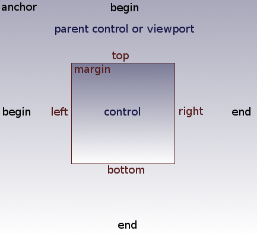
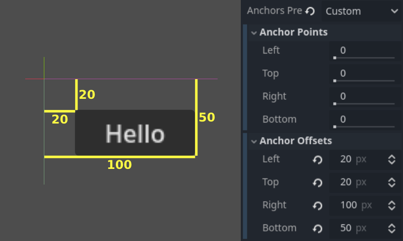
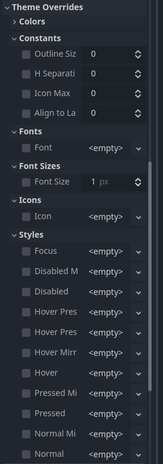
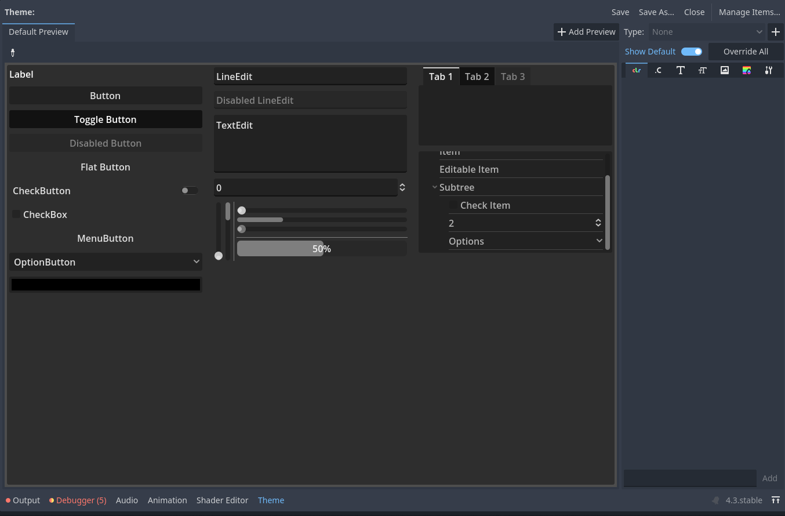
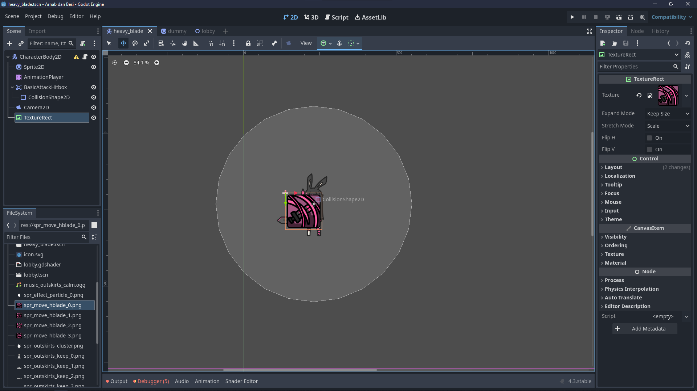
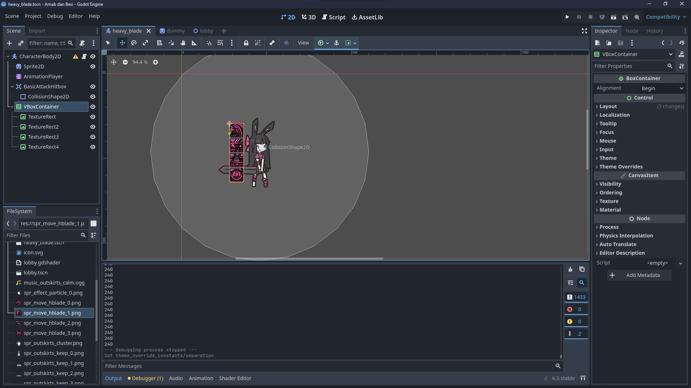
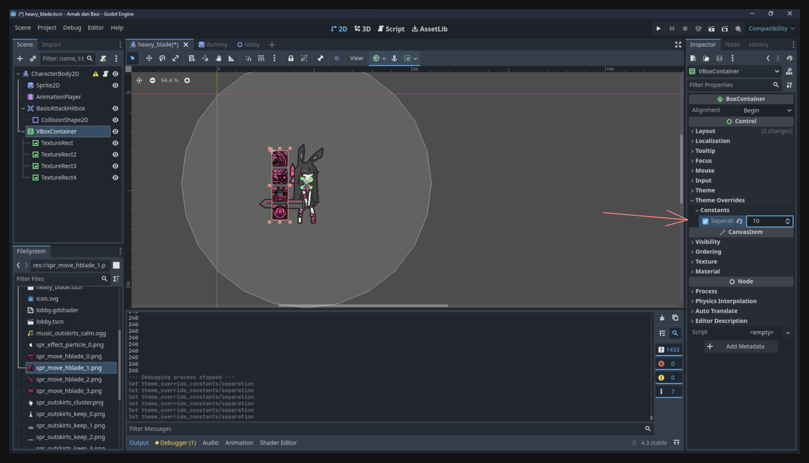
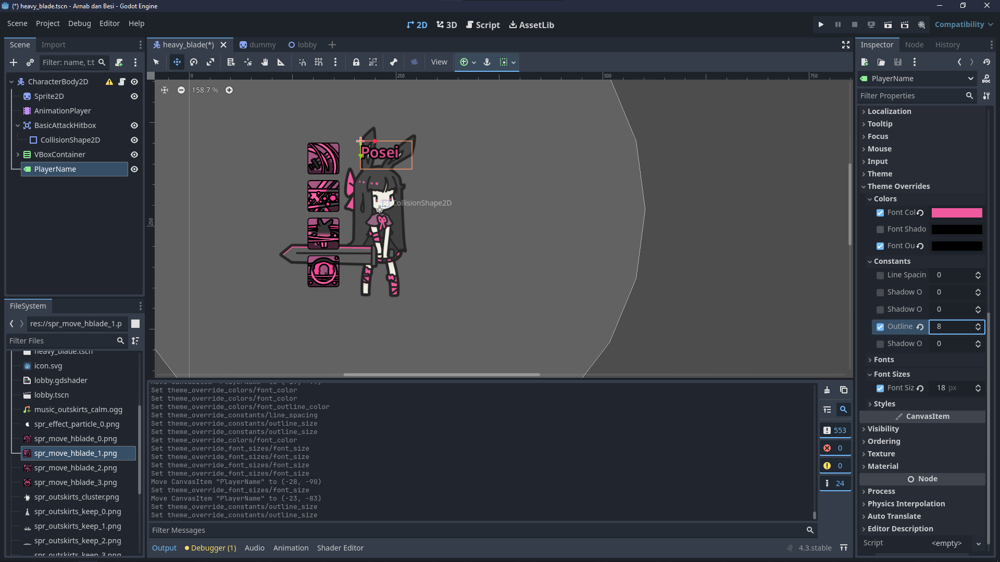

## Introduction
Dalam sebuah game, user interface (UI) sering jadi penghubung antara pemain dengan dunia game. UI ngasih feedback ke pemain, nampilin informasi kayak health bar, cooldown, dan menu, serta bantu ngarahin interaksi. 

Godot punya sistem UI yang cukup lengkap lewat Control nodes. Node-node ini ngedukung layout yang fleksibel, styling, dan pola interaksi. Sepanjang pelajaran ini, kita bakal mulai dari dasar konsep biar nyaman kerja dengan UI Godot. Habis itu, kita bikin contoh praktis berupa UI karakter sederhana.

Ini merupakan awal dari topik yang agak “berat di teori” sebelum kita bener-bener nyemplung ke implementasi UI secara langsung. Di akhir, kamu bakal bisa naro dan nge-styling elemen UI dasar di game serta paham gimana Control nodes ngatur posisi dan tampilan.

> **Catatan soal shaders**: Walaupun Godot dukung penggunaan shaders buat efek UI yang lebih canggih—misal transisi custom, highlight unik, atau efek visual khusus—kita ga bakal ngebahasnya di pelajaran ini (kita masih takut sama shaderss waaahh 🗣️). Shaders emang keren dan powerfull, terutama kalo built-in material properties atau opsi styling biasa kurang memadai. Tapi kalo kita ajarin shaders sekarang, dikhawatirkan bikin kita nyasar dari fokus utama: paham layout, styling, dan interaksi UI dasar di Godot. Kita bakal balik lagi ke shaders nanti setelah kamu cukup nyaman sama sistem UI di Godot.

## What does it take to learn how to make a UI?
Mirip sama bikin UI di web atau mobile, kamu bisa bayangin UI Godot terdiri dari tiga pilar utama:

1. **Layouting system** – Gimana elemen UI (controls) diatur posisi dan ukurannya.  
2. **Style system** – Gimana tampilan elemen UI diatur, termasuk tema dan kustomisasi visual.  
3. **Interaction system** – Gimana pengguna (pemain) berinteraksi sama elemen-elemen ini, misalnya pencet tombol atau ngetik teks.  

Kalo kamu udah familiar sama teknologi web, ini mirip kayak belajar model layout HTML/CSS (misalnya flexbox atau grid), styling dengan CSS, dan event handler di JS. Di Godot, konsepnya serupa tapi berbeda di penamaan dan cara pakainya.

## Godot UI System
UI di Godot dibangun pake **Control** nodes, yang masuk kategori “green” di daftar Node. Umumnya, Control nodes dipake buat dua hal: nampilin konten atau ngatur layout. Yuk kita bedah:

### Content
Node-node UI yang tugasnya lebih ke nampilin informasi atau interaksi pemain. Contohnya:
- **Button**: Nampilin teks dan/atau ikon, bisa di-klik.
- **Label**: Nampilin teks.
- **TextureRect**: Nampilin gambar atau sprite.

Tiap node tipe konten punya properti yang ngatur tampilannya (misal, `Button` punya properti `text` dan `icon`).

### Layout
Node layout biasanya ga nampilin apa-apa secara visual. Fungsinya ngatur dan nyusun posisi Control nodes lain. Contohnya:
- **VBoxContainer**: Nyusun anak-anak nodenya secara vertikal.  
- **HBoxContainer**: Nyusun anak-anak nodenya secara horizontal.  
- **GridContainer**: Nyusun anak-anak nodenya dalam format grid.  

Pake layout nodes bikin posisi dan jarak antar elemen UI konsisten tanpa harus “geser-geser pixel” satu per satu.

## Layouting System
Sistem layout yang kuat penting banget biar UI kamu tetap bagus di berbagai ukuran layar dan rasio aspek. Control node di Godot ngandelin anchor dan offset supaya bisa adaptasi dan reflow di resolusi atau orientasi layar yang beda.

### Size and Anchor
Kalo game-mu cuma jalan di satu device dengan resolusi tetap, cukup naro elemen UI di posisi dan ukuran tertentu aja. Tapi kebanyakan game perlu adaptasi ke banyak device (mis. HP, tablet, monitor macam-macam).

**Anchors** dan **Offsets** ngasih kamu cara buat atur gimana elemen UI nge-resize atau mindah posisi relatif ke parent atau viewport.



1. **Anchor**: Nilai antara 0.0 sampe 1.0 untuk tiap sisi (kiri, kanan, atas, bawah), merefleksikan persentase dari dimensi parent atau viewport.  
2. **Offset**: Jarak berbasis pixel dari anchor tersebut.

Dengan ngombinasikan anchor dan offset, kamu bisa bikin elemen UI nge-scale atau geser dengan benar pas ukuran layar berubah. Misal, kalo anchor kanan kamu set ke `1.0` dan anchor kiri `0.0`, maka control bakal memanjang horizontal ngerentang semua area parent. Selain itu, offset yang negatif juga bisa naro elemen UI sedikit keluar dari area anchor kalo perlu.



> **Tip**: Gunakan menu **Anchor Presets** di toolbar buat setup pola anchor dan offset yang sering dipake, kayak ngeposisiin Control node di pojok atas-kiri atau bikin dia nge-stretch ke seluruh parent.


### Automatically resizing for different screens
Kalo kamu bikin Control node dengan anchor yang lebih fleksibel—misalnya top di `0.0` dan bottom di `1.0`—node itu bakal nyoba memanjang dari atas sampe bawah parent. Kalo sekaligus anchor horizontalnya juga `0.0` ke `1.0`, dia bakal ke-stretch ke dua arah. Ini membantu kalo kamu mau UI otomatis ngepasin diri di berbagai ukuran layar.

## Styling
Styling di Godot biasanya lebih gampang dipahami daripada layout. Begitu kamu tau di mana harus nerapin setting theme atau style override, kamu bisa cepet bikin UI kelihatan seragam.

### Theme Override
Setiap Control node punya properti **Theme Override**. Ini memungkinkan kamu kustom tampilan node tersebut (mis. warna, font, background image, dsb.) langsung di Inspector pada bagian “Theme Overrides.”



### Theme Resources
Buat styling yang konsisten di banyak elemen UI, kamu bisa bikin satu **Theme resource**. Kalo resource ini kamu assign ke properti `theme` di sebuah Control node, maka node itu (dan child-nya, kalo diatur buat ngikut) akan berbagi style yang sama.

Pas ngedit Theme resource, kamu bakal ngeliat daftar panjang elemen UI yang bisa dikustom. Pendekatan ini emang butuh setelan awal yang lumayan, tapi hasilnya UI kamu bisa punya gaya yang kompak. Theme yang sama bisa kamu pake di banyak scene dan node.



## Building our character UI
Bayangin contoh referensi ini:

<video src="reference_ui.mp4" controls></video>

Kamu liat di situ:
- Ikon statis yang mewakili serangan dan skill.  
- Ikon jadi transparan pas karakter nyerang.  
- Ikon jadi gelap pas cooldown.  
- Ikon glow pas dipencet.  
- Ada indikator loading saat global cooldown.  

Mungkin keliatan ribet kalo ngeliat sekilas, tapi kalo dipecah: itu cuma kumpulan gambar dan label yang ditata sama layout container, plus beberapa state dan feedback interaktif.

### Placing a static icon
Mulai kecil dulu. Kita coba nampilin ikon statis pake `TextureRect`. Node ini fungsinya simpel: nampilin tekstur atau gambar.

```plaintext
spr_move_hblade_0.png
spr_move_hblade_1.png
spr_move_hblade_2.png
spr_move_hblade_3.png
```

Kamu bisa drag salah satu tekstur itu ke properti `texture` di `TextureRect`:



Awalnya, ikon mungkin keliatan kegedean atau meleset posisinya. Bisa aja kamu scale manual, tapi itu rentan bikin berantakan. Lebih baik kamu ngandelin layout system.

### Using layout containers
Tambahin `VBoxContainer` ke scene lalu taruh `TextureRect` sebagai child. Container ini otomatis naro child-child-nya secara vertikal. Jadi kamu ga bisa lagi “drag” `TextureRect` sembarangan di editor, tapi UI bakal lebih rapi dan responsif.



Kamu bisa atur jarak antar item via properti `separation` di container, biasanya ada di bagian “Theme Overrides” di Inspector:



### Adding a label
Misalnya kamu pengen nampilin nama player di atas karakter, cukup tambahin `Label` node. Lalu atur text dan stylenya. Sama kaya sebelumnya, pastiin pake container layout biar posisinya ga random.



Begitu kamu tambahin semua elemen ini, kamu bakal punya UI simpel yang di-anchor deket karakter. Kamu bisa liat ikon statis dan label di preview:

<video src="static_ui.mp4" controls></video>

## Where we go from here
Mungkin kamu liat beberapa elemen UI (kayak skill icon) nempel sama karakter, sementara elemen lain “nempel” di layar (misal health bar di bagian atas). Pelajaran selanjutnya, kita bakal bahas cara naro UI di layer berbeda, biar kamu bisa milih mana yang harus tetep di layar dan mana yang harus gerak sama karakter.

Kita udah bahas banyak teori di pelajaran ini—mulai dari prinsip layout, anchor, sampai setup styling dasar. Luangin waktu buat eksperimen dulu dengan fundamental ini sebelum lanjut.

Karena topik ini emang rada berat di teori, kita sudahi dulu sampe sini biar otakmu ga terlalu penuh.

## Conclusion
Sistem UI di Godot pake Control nodes untuk segala hal, mulai dari label teks sederhana sampe menu yang kompleks. Paham cara kerja anchor, offset, dan container bikin kamu siap bikin interface fleksibel yang bisa adaptasi di berbagai ukuran device. Kalo layout udah stabil, kamu bisa kustom tampilan lewat theme override atau theme resources global.

Walaupun kita udah bahas dasar penempatan, ukuran, dan styling UI, masih banyak hal lain yang bisa digali, kayak pake signals buat interaksi atau efek canggih dengan shaders. Tapi untuk sekarang, fokus dulu sama inti layout ini. Di pelajaran selanjutnya, kita bakal bahas gimana cara naro UI di layar penuh atau level screen, sambil terus mempercantik interface game kita.